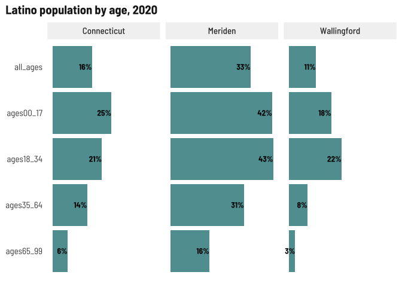
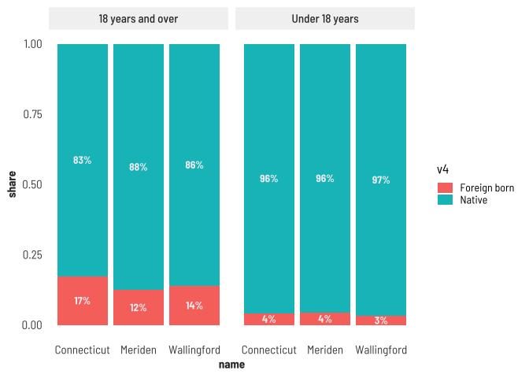

Quick population summary
================

``` r
library(tidyverse)
library(tidycensus)
library(cwi)
source("../../utils/plot_utils.R")
```

``` r
fetch_fb <- multi_geo_acs(table = "B05003", year = 2020, counties = NULL, towns = c("Meriden", "Wallingford")) %>%
  label_acs()

fetch_latino <- multi_geo_acs(table = "B01001I", year = 2020, counties = NULL, towns = c("Meriden", "Wallingford")) %>%
  label_acs() %>%
  mutate(race = "latino") %>% 
  select(name, race, estimate, moe, label)

fetch_total <- multi_geo_acs(table = "B01001", year = 2020, counties = NULL, towns = c("Meriden", "Wallingford")) %>%
  label_acs() %>%
  mutate(race = "total") %>% 
  select(name, race, estimate, moe, label)

age_total <- fetch_total %>% 
  separate(label, into = c("total", "sex", "age"), sep = "!!", fill = "right") %>%
  filter(!is.na(age) | ((is.na(age) & is.na(sex)))) %>% 
  replace_na(list(age = "all_ages")) %>%
  select(name, race, age, estimate) %>% 
  group_by(name, race) %>% 
  camiller::add_grps(list(all_ages = 1, ages00_17 = 2:5, ages18_34 = 6:11, ages35_64 = 12:18, ages65_99 = 19:24), group = age)

age_latino <- fetch_latino %>% 
  separate(label, into = c("total", "sex", "age"), sep = "!!", fill = "right") %>%
  filter(!is.na(age) | ((is.na(age) & is.na(sex)))) %>% 
  replace_na(list(age = "all_ages")) %>%
  select(name, race, age, estimate) %>% 
  group_by(name, race) %>% 
  camiller::add_grps(list(all_ages = 1, ages00_17 = 2:5, ages18_34 = 6:9, ages35_64 = 10:12, ages65_99 = 13:15), group = age)

race_age <- bind_rows(age_total, age_latino) %>% 
  ungroup() %>% 
  group_by(name, age) %>% 
  camiller::calc_shares(group = race, denom = "total", value = estimate)
```

``` r
race_age %>% 
  filter(race == "latino") %>% 
  ggplot(aes(x = share, y = fct_rev(age))) +
  geom_col(fill = "cadetblue") +
  geom_text(aes(label = scales::percent(share, accuracy = 1)), hjust = 1.01, color = "black") +
  facet_grid(cols = vars(name)) +
  labs(title = "Latino population by age, 2020", x = NULL, y = NULL) +
  theme(axis.text.x = element_blank())
```

<!-- -->

``` r
fb <- fetch_fb %>% 
  separate(label, into = c("v1", "v2", "v3", "v4", "v5"), fill = "right", sep = "!!") %>%
  filter(!is.na(v3), is.na(v5)) %>% 
  mutate(v4 = if_else(is.na(v4), "Total", v4)) %>% 
  group_by(year, level, name, v3, v4) %>% 
  summarise(estimate = sum(estimate),
            moe = moe_sum(moe = moe, estimate = estimate)) %>% 
  ungroup() %>% 
  group_by(year, level, name, v3) %>% 
  camiller::calc_shares(group = v4, denom = "Total", value = estimate, moe = moe)

fb %>% 
  ggplot(aes(x = name, y = share, group = name)) +
  geom_col(aes(fill = v4), position = position_stack(.5)) +
  geom_text(aes(label = scales::percent(share, accuracy = 1)), position = position_stack(.5)) +
  facet_grid(~v3)
```

<!-- -->
