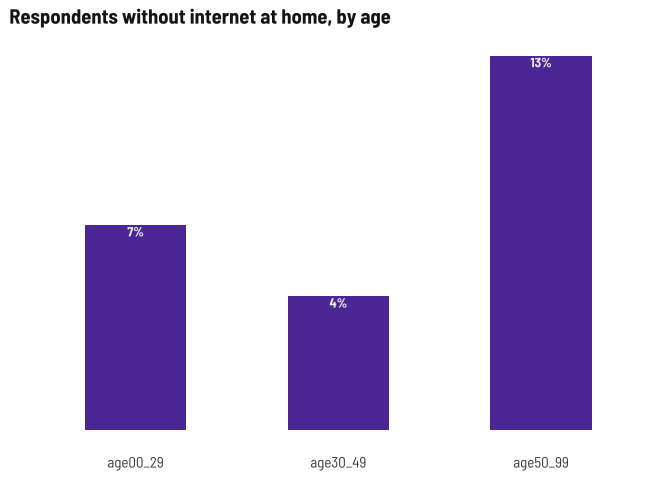
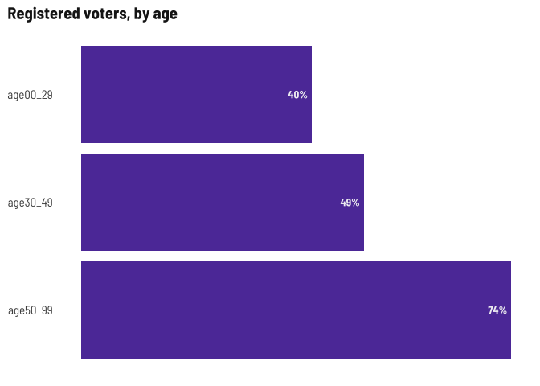

Respondent demographics
================

Current number of respondents (blanks removed) as of July 18, 2022.

| survey  | responses |
|:--------|----------:|
| English |       192 |
| Spanish |       255 |

This time around there are a couple English language respondents who
have issue with Latino-focused media. I’ve removed those responses from
here because it’s either a hateful write-in or not a real response to
the question. In another notebook, I’ll provide the open text responses.

# Demographics

### Gender

Respondents by gender

| gender                           | English | Spanish |
|:---------------------------------|:--------|:--------|
| Man                              | 38%     | 44%     |
| Non-binary/Gender non-conforming | 0%      | 0%      |
| Transgender                      | 0%      | 0%      |
| Woman                            | 61%     | 56%     |

### Age

It might be harder to get young people to respond based on current
outreach (grocery stores, links on articles, etc.) but maybe at the PR
festival? Otherwise, we do have the HS student focus group to help fill
in that gap.

I’m going to use under 40/over 40 for age disaggregation.

<!-- -->

### Town of residence

I only want to show the names of towns where 10+ respondents live. Right
now that’s only Meriden and Wallingford. Middletown and Waterbury are
getting up there, though.

| town        | English | Spanish |
|:------------|:--------|:--------|
| Meriden     | 67%     | 70%     |
| Wallingford | 13%     | 17%     |
| Other       | 20%     | 13%     |

### Ethnicity

Most respondents are Latino

| latino | English | Spanish |
|:-------|:--------|:--------|
| No     | 42%     | 0%      |
| Yes    | 58%     | 100%    |

### Place of birth

“Other” includes Argentina, Bangladesh, Brazil, Chile, Colombia, Costa
Rica, Cuba, Germany, Ghana, Guatemala, Haiti, Honduras, India, Jamaica,
Liberia, Morocco, Panama, Peru, Poland, Spain, Venezuela…

<!-- -->

### Language spoken at home

Other languages for Spanish survey were “dialect” and Portuguese, for
English survey: Polish, Marathi, Portuguese, Bengali, Bangala, and
Portuguese.

<!-- -->

### Internet-enabled devices and internet at home

Even though most people have the internet at home, fewer Spanish survey
respondents do, which might lend towards them preferring text, word of
mouth, etc. for news.

| internet          | English | Spanish |
|:------------------|:--------|:--------|
| No                | 5%      | 13%     |
| Prefer not to say | 2%      | 0%      |
| Yes               | 93%     | 87%     |

<!-- -->

### Registered voter

Voter registration status may be affected by citizenship status, since
so many Spanish language respondents were born abroad.

| registered                 | English | Spanish |
|:---------------------------|:--------|:--------|
| No                         | 16%     | 51%     |
| Not sure/Prefer not to say | 6%      | 9%      |
| Yes                        | 78%     | 40%     |

### Other demographic details

Lots of parents which makes sense given the grocery store outreach.
Fewer students among the Spanish language survey probably related to
fewer young people responding.

<!-- -->
