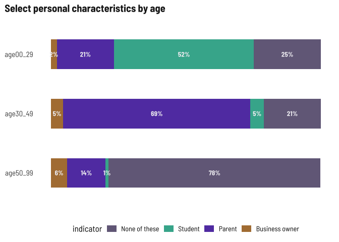

Respondent demographics
================

Current number of respondents (blanks removed) as of November 8, 2022.

**I’m going to stop disaggregating by survey type so we can focus on
disaggregating by other metrics, like age, gender, or nationality**

| survey  | responses |
|:--------|----------:|
| English |       755 |
| Spanish |       893 |
| Total   |      1648 |

# Demographics

### Age

This time around, I’ll group ages into 0-29, 30-49, and 50+

<!-- -->

### Gender x age

Across all age groups, more women than men responding, with greatest
disparity in 30-49 range. Keep that in mind as we look at these
age-based breakdowns later.

<!-- -->

### Town of residence

Someone asked to show the top 5 towns

<!-- -->

### Ethnicity x gender x age

Slightly lower shares identifying as Latino in older populations

<!-- -->

### Place of birth x age

Adults ages 30-49 more likely than other age groups to have been born
abroad.

<!-- -->

### Language spoken at home x age

<!-- -->

### Internet-enabled devices and internet at home x age

<!-- -->

<!-- -->

### Registered voter

<!-- -->

## Other demographic details

76 business owners out of 1648 responses is pretty low (\<5% of
respondents), 11% are students, 40% are parents. I’ll only break this
down by age.

    ## # A tibble: 4 × 2
    ##   indicator          n
    ##   <fct>          <int>
    ## 1 Business owner    76
    ## 2 Parent           663
    ## 3 Student          189
    ## 4 None of these    678

Half of the respondents under 30 are students, more than 2/3s of the
respondents 30-49 are parents, and just slightly more of the respondents
over 50 are business owners.

<!-- -->
