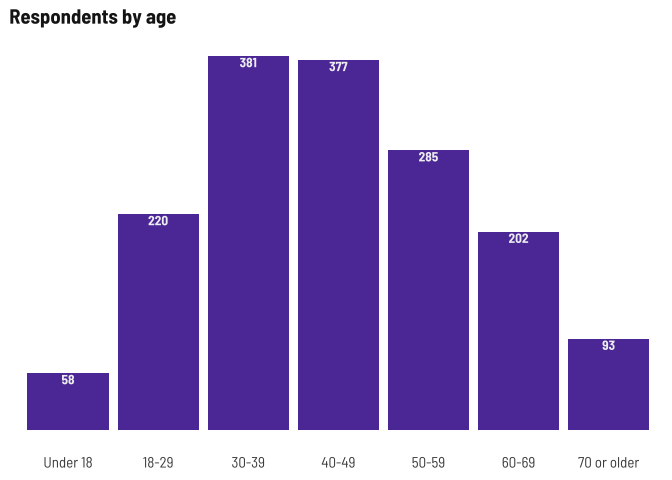

Respondent demographics
================

Current number of respondents (blanks removed) as of November 8, 2022.

**I’m going to stop disaggregating by survey type so we can focus on
disaggregating by other metrics, like age, gender, or nationality**

| survey  | responses |
|:--------|----------:|
| English |       755 |
| Spanish |       893 |
| Total   |      1648 |

# Demographics

### Age

This time around, I’ll group ages into 0-29, 30-49, and 50+

<!-- -->

### Gender x age

Across all age groups, more women than men responding, with greatest
disparity in 30-49 range. Keep that in mind as we look at these
age-based breakdowns later.

<!-- -->

### Town of residence

Someone asked to show the top 5 towns

<!-- -->

### Ethnicity x gender x age

Slightly lower shares identifying as Latino in older populations

<!-- -->

### Place of birth

<!-- -->

### Language spoken at home

<!-- -->

### Internet-enabled devices and internet at home

| internet | English | Spanish |
|:---------|:--------|:--------|
| No       | 5%      | 10%     |
| Yes      | 95%     | 90%     |

<!-- -->

### Registered voter

| registered                 | English | Spanish |
|:---------------------------|:--------|:--------|
| No                         | 19%     | 53%     |
| Not sure/Prefer not to say | 5%      | 7%      |
| Yes                        | 76%     | 40%     |

### Other demographic details

<!-- -->
