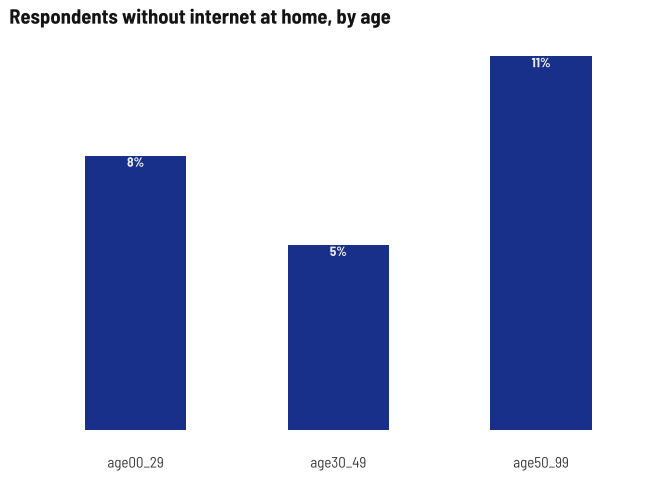
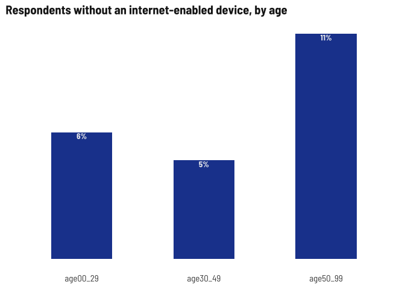
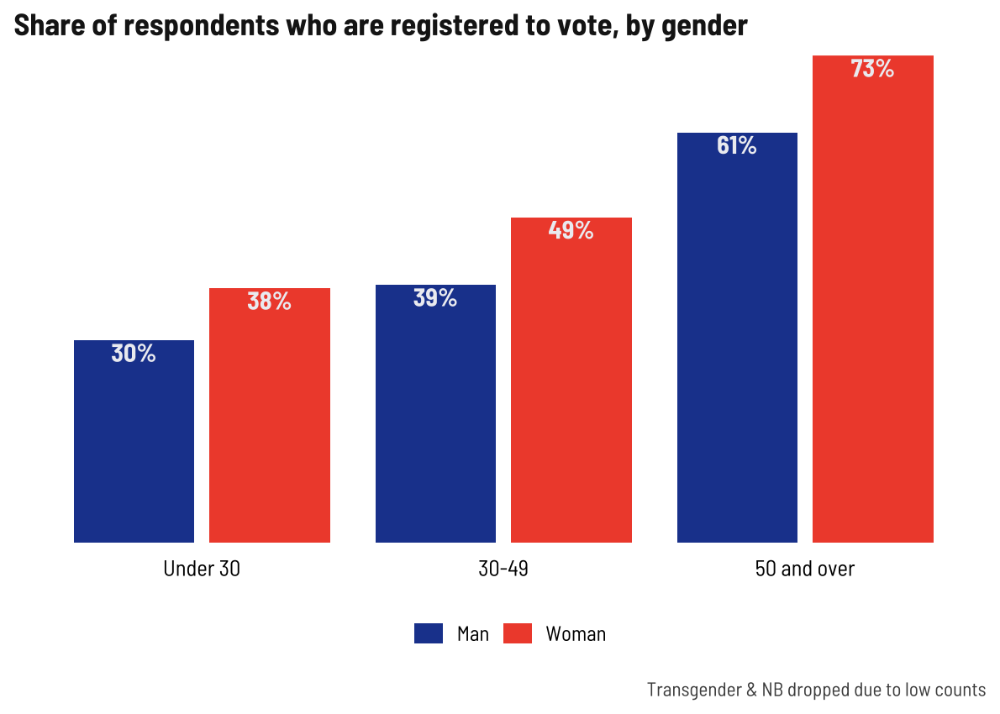
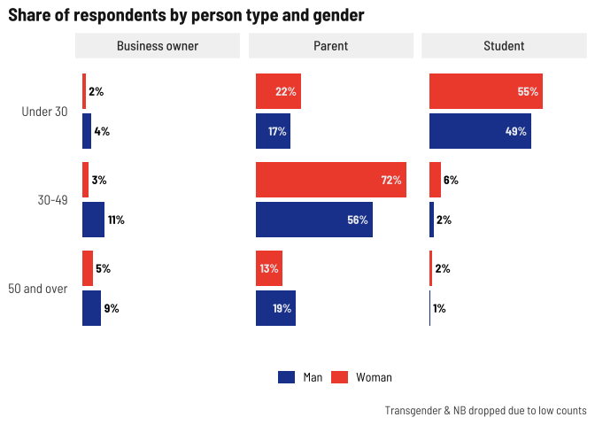

Respondent demographics
================

Current number of respondents (blanks removed) as of November 8, 2022.

| survey  |    n |
|:--------|-----:|
| English |  863 |
| Spanish | 1170 |
| Total   | 2033 |

**I’m going to stop disaggregating by survey type so we can focus on
disaggregating by other metrics, like age, gender, or nationality**

## Age

<!-- -->

This time around, I’ll group ages into 0-29, 30-49, and 50+

## Gender x age

Across all age groups, more women than men responding, with greatest
disparity in 30-49 range. Keep that in mind as we look at these
age-based breakdowns later.

**Also we are now HEAVILY skewed towards middle-aged women**

| gender           |    n | share |
|:-----------------|-----:|:------|
| Woman            | 1145 | 56%   |
| Man              |  840 | 41%   |
| NA               |   26 | 1%    |
| Opt out          |   11 | 1%    |
| Transgender & NB |   11 | 1%    |

<!-- -->

## Town of residence

Someone asked to see the top 5 towns

<!-- -->

## Ethnicity x gender x age

Slightly lower shares of older adults identifying as Latino

<!-- -->

## Place of birth x age

Younger and older people more likely to be born in the US/PR. I am
surprised at the diversity in the 30-49 crowd.

| place_of_birth     |   n | share |
|:-------------------|----:|:------|
| DOMINICAN REPUBLIC |  75 | 4%    |
| ECUADOR            | 202 | 10%   |
| MEXICO             | 271 | 13%   |
| OTHER              | 381 | 19%   |
| PUERTO RICO        | 476 | 23%   |
| USA                | 628 | 31%   |

<!-- -->

## Language spoken at home x age

Pretty even language split among older adults.

| language                 |   n | share |
|:-------------------------|----:|:------|
| Both English and Spanish | 900 | 46%   |
| English                  | 439 | 22%   |
| Spanish                  | 622 | 32%   |

<!-- -->

## Internet-enabled devices and internet at home x age

I’m kind of shocked at the under-30 lack of device/internet, but not at
the notable increase in lack of internet in older age groups; lack of
device corresponds with lack of internet.

<!-- -->

<!-- -->

## Registered voter x age x gender

This is pretty typical nationwide.

<!-- -->

## Other demographic details

Unsurprisingly, half of the students are younger people, middle aged
adults have kids under 18. Few business owners.

<!-- -->
