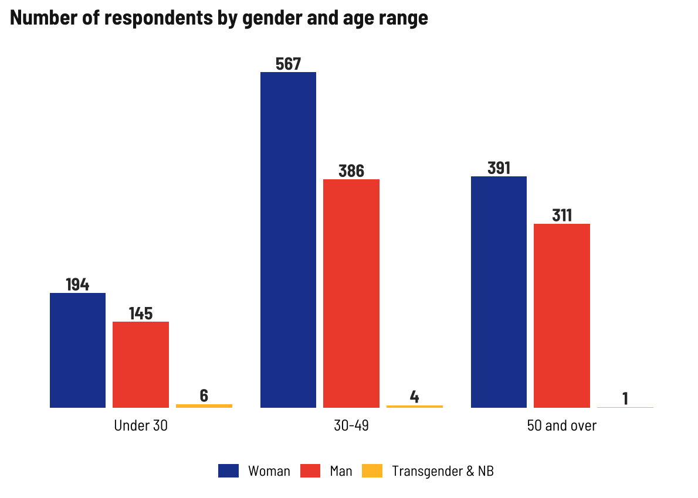
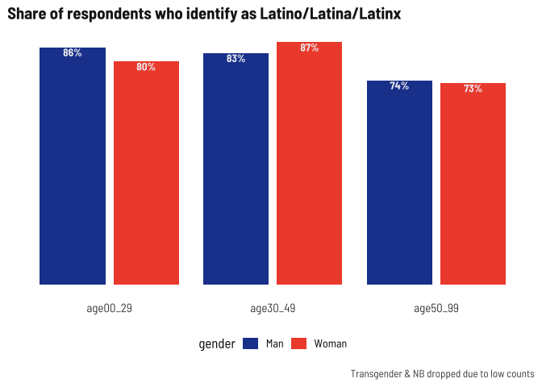

Respondent demographics
================

Current number of respondents (blanks removed) as of November 8, 2022.

| survey  |    n |
|:--------|-----:|
| English |  747 |
| Spanish |  884 |
| Total   | 1631 |

**I’m going to stop disaggregating by survey type so we can focus on
disaggregating by other metrics, like age, gender, or nationality**

## Age

<!-- -->

This time around, I’ll group ages into 0-29, 30-49, and 50+

## Gender x age

Across all age groups, more women than men responding, with greatest
disparity in 30-49 range. Keep that in mind as we look at these
age-based breakdowns later.

**Also we are now HEAVILY skewed towards middle-aged women**

| gender           |   n |
|:-----------------|----:|
| Woman            | 963 |
| Man              | 635 |
| NA               |  19 |
| Opt out          |   7 |
| Transgender & NB |   7 |

<!-- -->

## Town of residence

Someone asked to see the top 5 towns

<!-- -->

## Ethnicity x gender x age

Slightly lower shares of older adults identifying as Latino

| latino  |    n |
|:--------|-----:|
| Yes     | 1272 |
| No      |  301 |
| Opt out |   38 |
| NA      |   20 |

<!-- -->

## Place of birth x age

## Language spoken at home x age

## Internet-enabled devices and internet at home x age

## Registered voter

## Other demographic details
