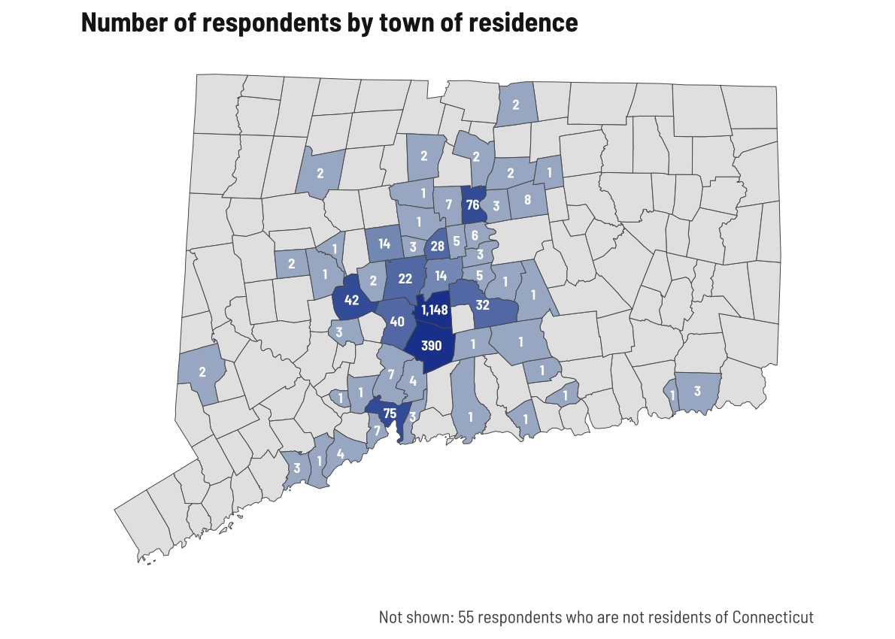
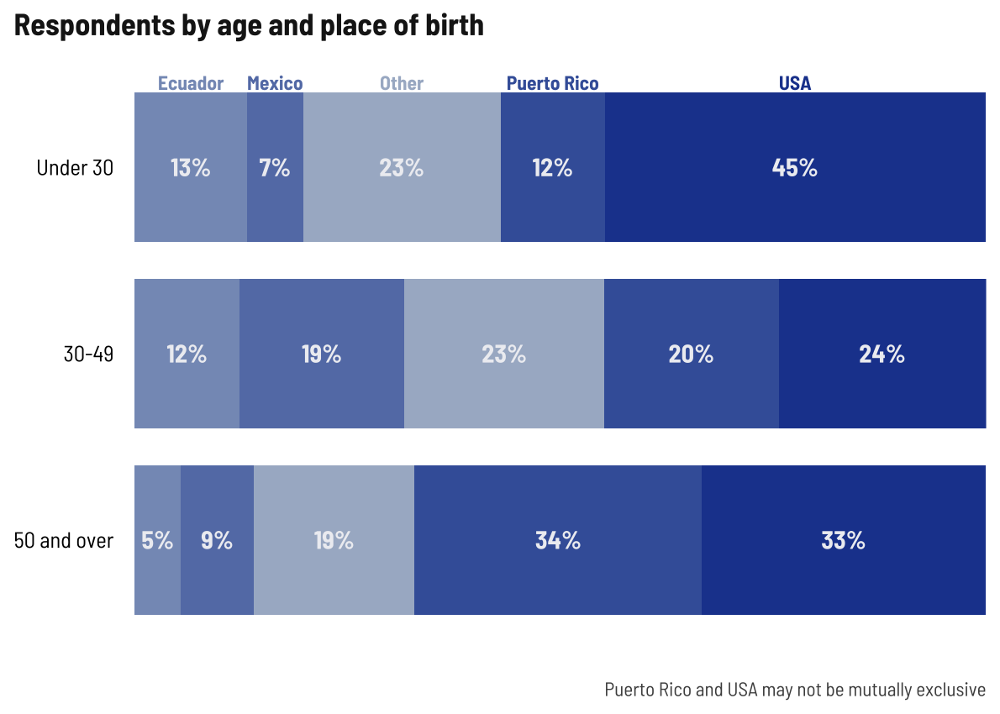

Respondent demographics
================

Current number of respondents (blanks removed) as of January 3, 2023.

    ##   survey    n
    ##  English  867
    ##  Spanish 1176
    ##    Total 2043

**I’m going to stop disaggregating by survey type so we can focus on
disaggregating by other metrics, like age, gender, or nationality**

## Age

<!-- -->

This time around, I’ll group ages into 0-29, 30-49, and 50+

## Gender x age

Across all age groups, more women than men responding, with greatest
disparity in 30-49 range. Keep that in mind as we look at these
age-based breakdowns later.

<!-- -->

## Town of residence

<!-- -->

## Ethnicity x gender x age

Slightly lower shares of older adults identifying as Latino

    ## # A tibble: 6 × 5
    ##   age      gender latino     n share
    ##   <chr>    <chr>  <fct>  <int> <dbl>
    ## 1 age00_29 Man    Yes      124 0.855
    ## 2 age00_29 Woman  Yes      156 0.804
    ## 3 age30_49 Man    Yes      322 0.834
    ## 4 age30_49 Woman  Yes      495 0.873
    ## 5 age50_99 Man    Yes      229 0.736
    ## 6 age50_99 Woman  Yes      284 0.726

## Place of birth x age

Younger and older people more likely to be born in the US/PR. I am
surprised at the diversity in the 30-49 crowd.

<!-- -->

## Language spoken at home x age

Pretty even language split among older adults.

<!-- -->

## Internet-enabled devices and internet at home x age

I’m kind of shocked at the under-30 lack of device/internet, but not at
the notable increase in lack of internet in older age groups; lack of
device corresponds with lack of internet.

    ## # A tibble: 3 × 4
    ## # Groups:   age [3]
    ##   age      web_at_home     n share
    ##   <chr>    <fct>       <int> <dbl>
    ## 1 age00_29 No             28 0.08 
    ## 2 age30_49 No             52 0.054
    ## 3 age50_99 No             77 0.109

    ## # A tibble: 3 × 4
    ## # Groups:   age [3]
    ##   age      web_device     n share
    ##   <chr>    <fct>      <int> <dbl>
    ## 1 age00_29 No            22 0.063
    ## 2 age30_49 No            48 0.049
    ## 3 age50_99 No            79 0.112

    ## # A tibble: 9 × 4
    ## # Groups:   age [3]
    ##   age      neither         n  share
    ##   <chr>    <fct>       <int>  <dbl>
    ## 1 age00_29 Total         349 NA    
    ## 2 age00_29 Neither        10  0.029
    ## 3 age00_29 One or both   339  0.971
    ## 4 age30_49 Total         971 NA    
    ## 5 age30_49 Neither        15  0.015
    ## 6 age30_49 One or both   955  0.984
    ## 7 age50_99 Total         708 NA    
    ## 8 age50_99 Neither        42  0.059
    ## 9 age50_99 One or both   665  0.939

## Registered voter x age x gender

This is pretty typical nationwide.

<!-- -->

## Other demographic details

Unsurprisingly, half of the students are younger people, middle aged
adults have kids under 18. Few business owners.

    ## # A tibble: 15 × 4
    ##    age      person_type        n  share
    ##    <chr>    <fct>          <int>  <dbl>
    ##  1 age00_29 Total            349 NA    
    ##  2 age00_29 Business owner     9  0.026
    ##  3 age00_29 None of these     89  0.255
    ##  4 age00_29 Parent            66  0.189
    ##  5 age00_29 Student          185  0.53 
    ##  6 age30_49 Total            971 NA    
    ##  7 age30_49 Business owner    59  0.061
    ##  8 age30_49 None of these    239  0.246
    ##  9 age30_49 Parent           627  0.646
    ## 10 age30_49 Student           42  0.043
    ## 11 age50_99 Total            708 NA    
    ## 12 age50_99 Business owner    47  0.066
    ## 13 age50_99 None of these    536  0.757
    ## 14 age50_99 Parent           109  0.154
    ## 15 age50_99 Student            8  0.011
