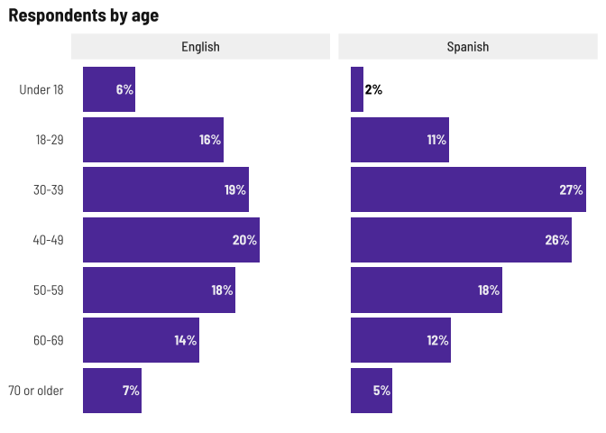
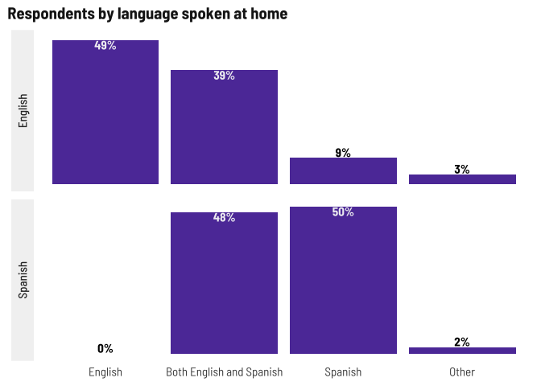

Respondent demographics
================

Add PR festival data, hard code paths since it won’t change, bind to
primary surveys.

Just realized I deleted an entire section from the English PR Festival
survey… I’ll summarize what we have for the Spanish respondents, but the
questions were those about what content they’d like to see.

Current number of respondents (blanks removed) as of August 30, 2022.

| survey  | responses |
|:--------|----------:|
| English |       438 |
| Spanish |       549 |

This time around there are a couple English language respondents who
have issue with Latino-focused media. I’ve removed those responses from
here because it’s either a hateful write-in or not a real response to
the question. In another notebook, I’ll provide the open text responses.

# Demographics

### Gender

Respondents by gender

| gender                           | English | Spanish |
|:---------------------------------|:--------|:--------|
| Man                              | 37%     | 42%     |
| Non-binary/Gender non-conforming | 0%      | 0%      |
| Transgender                      | 0%      | 0%      |
| Woman                            | 62%     | 58%     |

### Age

It might be harder to get young people to respond based on current
outreach (grocery stores, links on articles, etc.) but maybe at the PR
festival? Otherwise, we do have the HS student focus group to help fill
in that gap.

I’m going to use under 40/over 40 for age disaggregation.

<!-- -->

### Town of residence

The vast majority are still in Meriden and Wallingford but now we also
have a couple from Mass and several other towns around CT.

| town        | English | Spanish |
|:------------|:--------|:--------|
| Meriden     | 66%     | 70%     |
| Wallingford | 11%     | 13%     |
| Other       | 24%     | 17%     |

### Ethnicity

Most respondents are Latino

| latino | English | Spanish |
|:-------|:--------|:--------|
| No     | 38%     | 1%      |
| Yes    | 62%     | 99%     |

### Place of birth

“Other” includes Argentina, Bangladesh, Brazil, Chile, Colombia, Costa
Rica, Cuba, Germany, Ghana, Guatemala, Haiti, Honduras, India, Jamaica,
Liberia, Morocco, Panama, Peru, Poland, Spain, Venezuela…

<!-- -->

### Language spoken at home

Other languages for Spanish survey were “dialect” and Portuguese, for
English survey: Polish, Marathi, Portuguese, Bengali, Bangala, and
Portuguese.

<!-- -->

### Internet-enabled devices and internet at home

Even though most people have the internet at home, fewer Spanish survey
respondents do, which might lend towards them preferring text, word of
mouth, etc. for news.

| internet | English | Spanish |
|:---------|:--------|:--------|
| No       | 5%      | 12%     |
| Yes      | 95%     | 88%     |

<!-- -->

### Registered voter

Voter registration status may be affected by citizenship status, since
so many Spanish language respondents were born abroad.

| registered                 | English | Spanish |
|:---------------------------|:--------|:--------|
| No                         | 17%     | 50%     |
| Not sure/Prefer not to say | 6%      | 5%      |
| Yes                        | 78%     | 44%     |

### Other demographic details

Lots of parents which makes sense given the grocery store outreach.
Fewer students among the Spanish language survey probably related to
fewer young people responding.

<!-- -->
