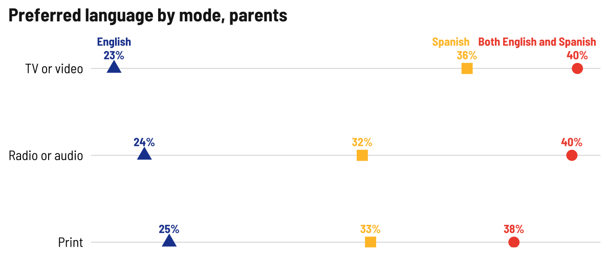
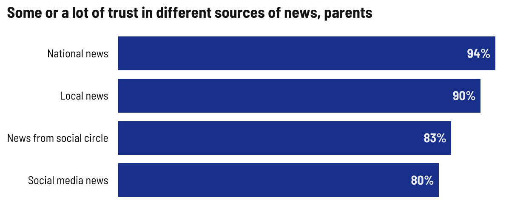
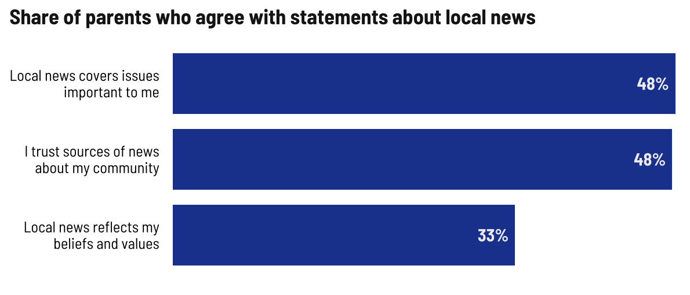
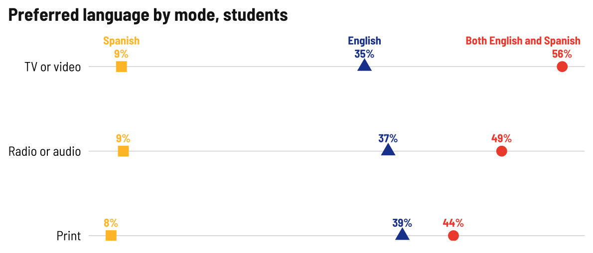
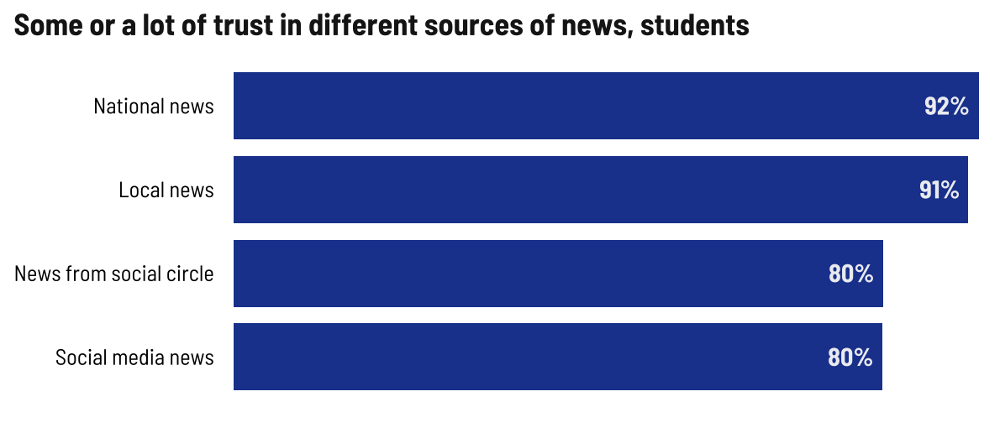
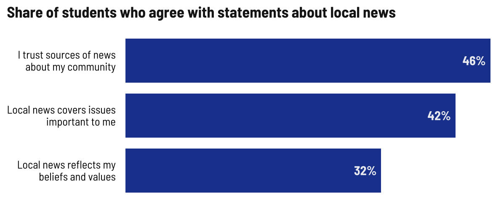

Misc breakdowns
================

## Parents

    ## # A tibble: 1 × 1
    ##       n
    ##   <int>
    ## 1   803

    ## # A tibble: 3 × 2
    ## # Groups:   language [3]
    ##   language                     n
    ##   <chr>                    <int>
    ## 1 Both English and Spanish   335
    ## 2 English                    135
    ## 3 Spanish                    314

    ## # A tibble: 2 × 2
    ## # Groups:   gender [2]
    ##   gender     n
    ##   <chr>  <int>
    ## 1 Man      299
    ## 2 Woman    501

    ## # A tibble: 3 × 2
    ## # Groups:   latino_by_pob [3]
    ##   latino_by_pob           n
    ##   <chr>               <int>
    ## 1 Foreign-born Latino   435
    ## 2 Not Latino             99
    ## 3 US-born Latino        251

    ## # A tibble: 3 × 2
    ## # Groups:   web_device [3]
    ##   web_device            n
    ##   <chr>             <int>
    ## 1 No                   54
    ## 2 Prefer not to say     4
    ## 3 Yes                 739

    ## # A tibble: 3 × 2
    ## # Groups:   web_at_home [3]
    ##   web_at_home           n
    ##   <chr>             <int>
    ## 1 No                   44
    ## 2 Prefer not to say     4
    ## 3 Yes                 752

    ## # A tibble: 1 × 1
    ##       n
    ##   <int>
    ## 1    18

<!-- -->

<!-- -->

<!-- -->

<!-- -->

## Students

    ## # A tibble: 1 × 1
    ##       n
    ##   <int>
    ## 1   235

    ## # A tibble: 3 × 2
    ## # Groups:   language [3]
    ##   language                     n
    ##   <chr>                    <int>
    ## 1 Both English and Spanish   121
    ## 2 English                     61
    ## 3 Spanish                     45

    ## # A tibble: 3 × 2
    ## # Groups:   gender [3]
    ##   gender               n
    ##   <chr>            <int>
    ## 1 Man                 81
    ## 2 Transgender & NB     7
    ## 3 Woman              143

    ## # A tibble: 3 × 2
    ## # Groups:   latino_by_pob [3]
    ##   latino_by_pob           n
    ##   <chr>               <int>
    ## 1 Foreign-born Latino    57
    ## 2 Not Latino             38
    ## 3 US-born Latino        133

    ## # A tibble: 3 × 2
    ## # Groups:   web_device [3]
    ##   web_device            n
    ##   <chr>             <int>
    ## 1 No                    4
    ## 2 Prefer not to say     1
    ## 3 Yes                 229

    ## # A tibble: 3 × 2
    ## # Groups:   web_at_home [3]
    ##   web_at_home           n
    ##   <chr>             <int>
    ## 1 No                    5
    ## 2 Prefer not to say     1
    ## 3 Yes                 228

    ## # A tibble: 1 × 1
    ##       n
    ##   <int>
    ## 1     2

<!-- -->

<!-- -->

<!-- -->

<!-- -->
