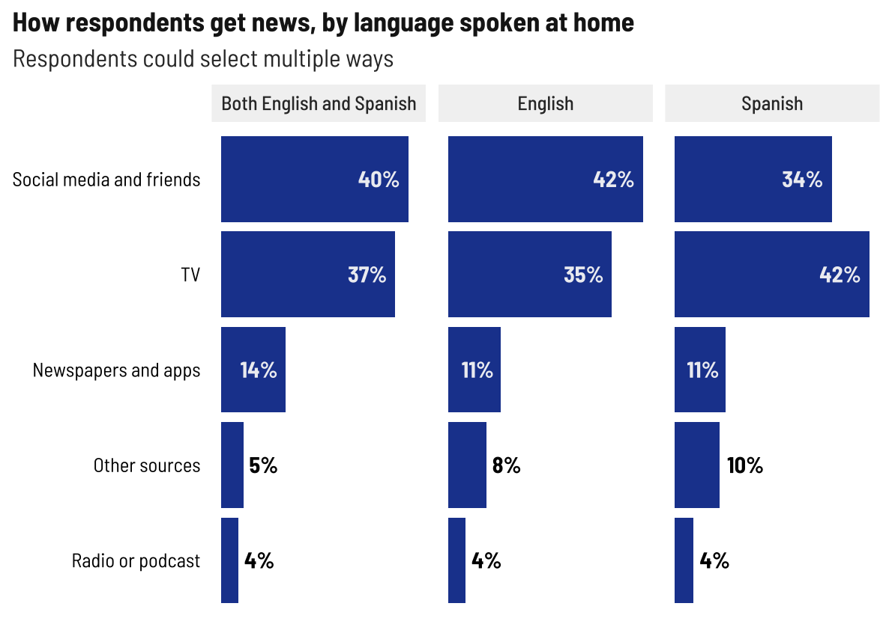
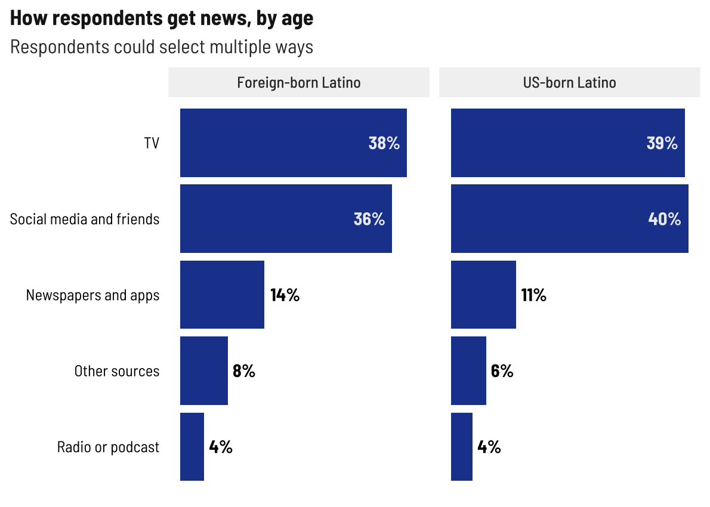
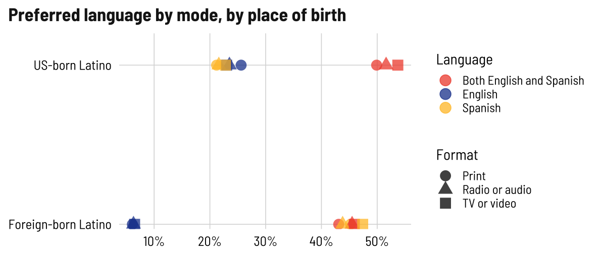
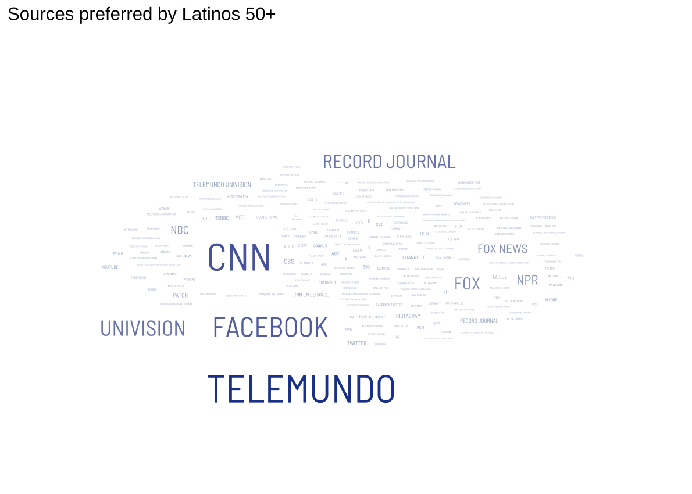
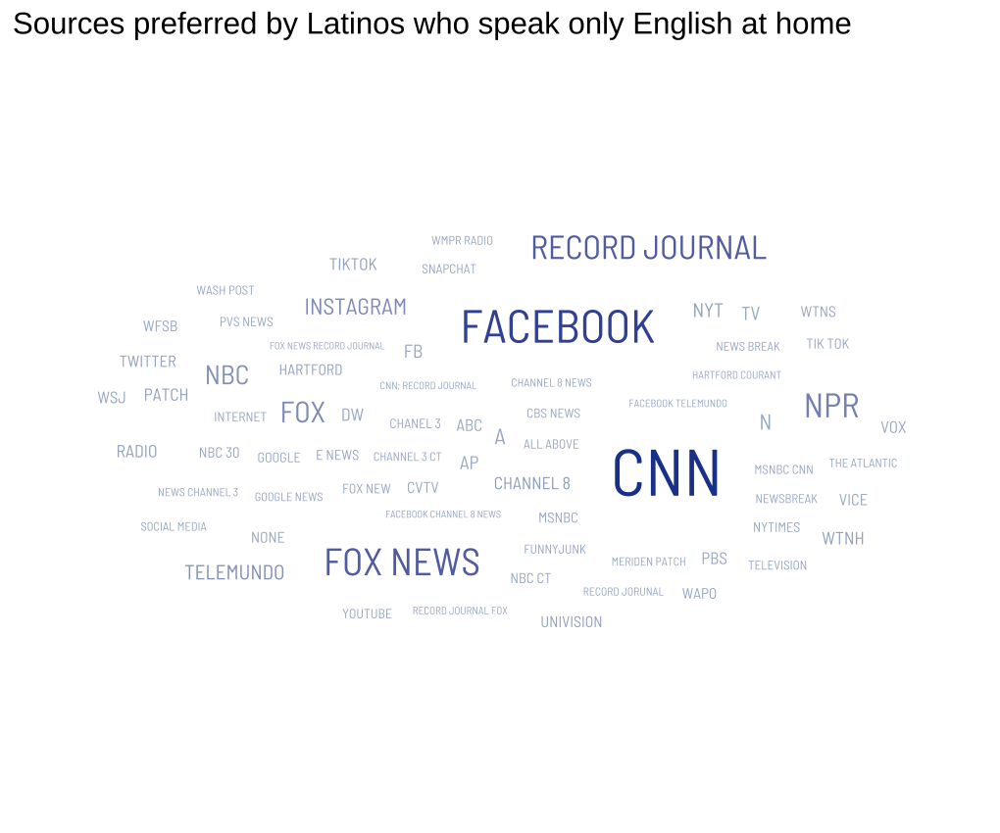
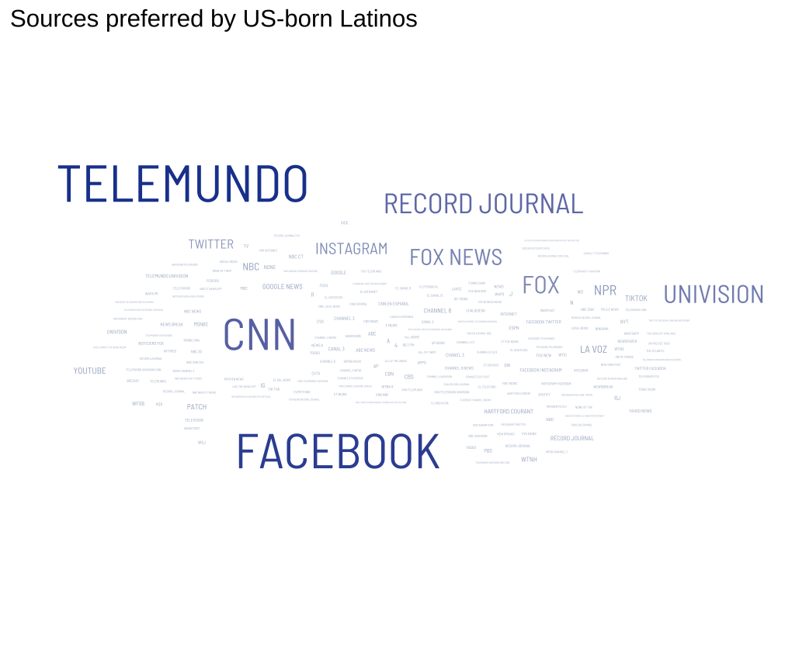
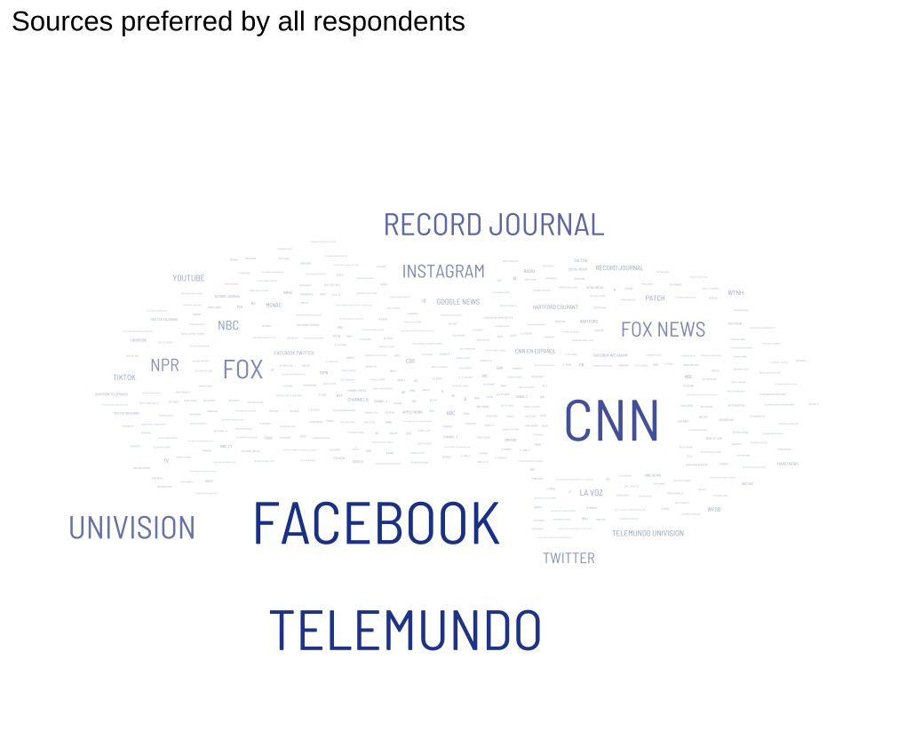

News habits
================

## Media used vs. Media preferred by total, age, and language at home

Overall totals not surprising. Strong preference for TV and social
media. I think we can just look at “used.”

<!-- -->

I expected to see social media top the list for younger people. Social
media just ekeing out ahead of TV for 30-49 year olds is interesting. We
Millennials love a platform.

<!-- -->

<!-- -->

Huh, I expected more variation here, too. I guess TV and social media
are really it.

<!-- -->

<!-- -->

## Preferred language by age and ethnicity

<!-- -->

<!-- -->

<!-- -->

<!-- -->

<!-- -->

## News sources

Preferred sources is also an open text field. Mining for word clouds…

By age, young people put fewer answers in, older people put a lot more

<!-- --><!-- --><!-- -->

Telemundo far and away the favored source for Latinos

<!-- -->

Facebook stands out among Spanish speakers

<!-- --><!-- --><!-- -->

Foreign-born Latinos use Facebook more (more access to news sources from
abroad?)

<!-- --><!-- -->

Total for good measure

<!-- -->

Gender

<!-- --><!-- -->
