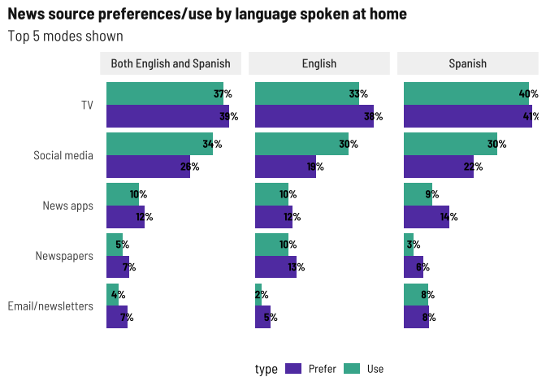
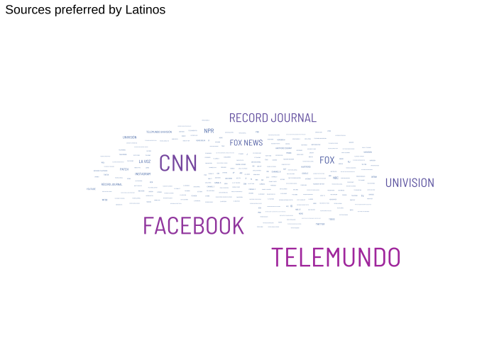

News habits
================

## Media used vs. Media preferred

I broke these into two charts by survey language and age so we can
compare what medium they prefer to which they use more easily.

For English language respondents under 40, social media is by far the
most popular way people use to get news and prefer to get news. The
over-40 crowd prefers TV and newspapers. There’s a bigger preference
than use for news apps (I wonder if people know they exist) and
newspapers (cost? access?). Again, newsletters might be something to
promote.

<!-- -->

I’m a bit surprised to see TV and social media pretty comparable for
Spanish language respondents under 40. Fully half of respondents over 40
prefer TV (accessible? covering more topics they’re interested in?).
While not as popular as social media, again, news apps and newsletters
might be something to promote.

<!-- -->

## Preferred language

With language, again a strong preference towards the survey language and
“both.” In future focus groups if we can ask people who prefer both why
they do, that would be helpful.

<!-- -->

## News sources

Preferred sources is also an open text field. Mining for a word cloud…

<!-- -->

## Geographic scope

Local news generally more popular than farther-out regions. Also note
that one person wrote in Puerto Rico for the geographical question.

<!-- -->

## Topics

**interpret**

<!-- -->

**interpret**

<!-- -->

## Special topics

Special topic areas being primarily focused on families makes sense with
who we’re surveying and how we’re collecting responses.

<!-- -->
