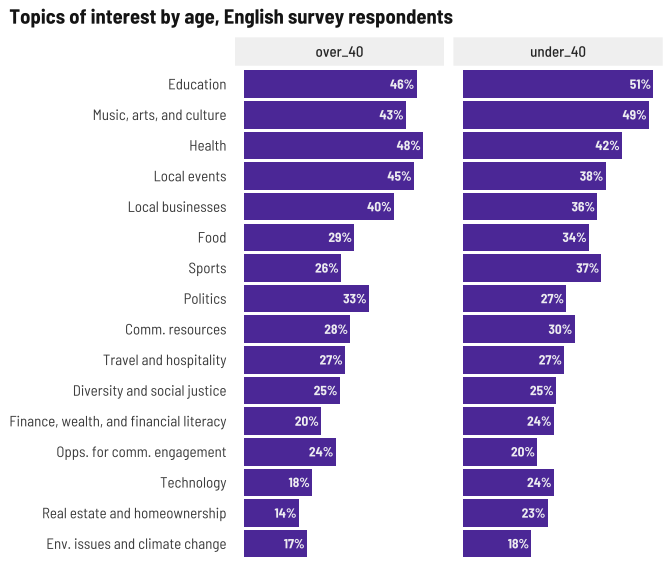

News habits
================

Add PR festival data, hard code paths since it won’t change, bind to
primary surveys.

Just realized I deleted an entire section from the English PR Festival
survey… I’ll summarize what we have for the Spanish respondents, but the
questions were those about what content they’d like to see.

## Media used vs. Media preferred

I broke these into two charts by survey language and age so we can
compare what medium they prefer to which they use more easily.

For English language respondents under 40, social media is by far the
most popular way people use to get news and prefer to get news. The
over-40 crowd prefers TV. There’s a bigger preference than use for news
apps (I wonder if people know they exist) and newspapers (cost?
access?). Again, newsletters might be something to promote.

<!-- -->

I’m a bit surprised to see TV and social media pretty comparable for
Spanish language respondents under 40. Fully half of respondents over 40
prefer TV (accessible? covering more topics they’re interested in?).
While not as popular as social media, again, news apps and newsletters
might be something to promote.

<!-- -->

## Preferred language

With language, again a strong preference towards the survey language and
“both.” In future focus groups if we can ask people who prefer both why
they do, that would be helpful.

<!-- -->

## News sources

Preferred sources is also an open text field. Mining for a word cloud…

<!-- --><!-- -->

## Geographic scope

Local news generally more popular than farther-out regions. Also note
that one person wrote in Puerto Rico for the geographical question.

<!-- -->

## Topics

Over and under 40 for the English language survey have the same top 5 or
so topics of interest with Education, Music/Arts/Culture, and Health
topping the lists.

<!-- -->

Health and Education top the list for Spanish survey respondents in both
age groups. For younger people, the next three are Sports, Politics, and
Music/Arts/Culture. For older people it’s Sports, Music/Arts/Culture,
and Local Events.

<!-- -->

## Special topics

Special topic areas being primarily focused on families makes sense with
who we’re surveying and how we’re collecting responses.

<!-- -->
