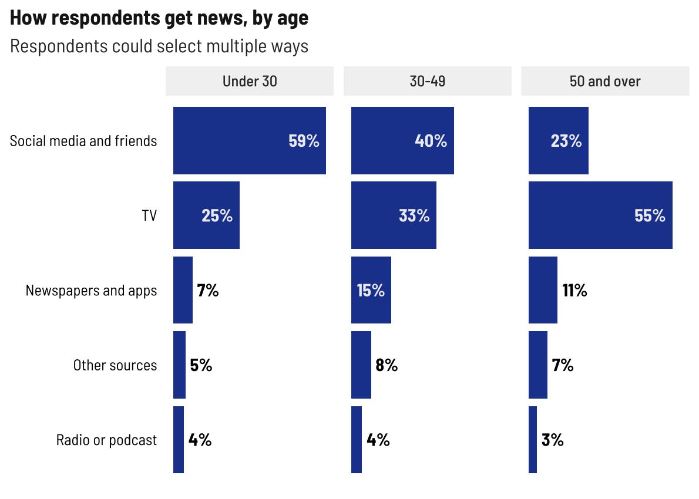
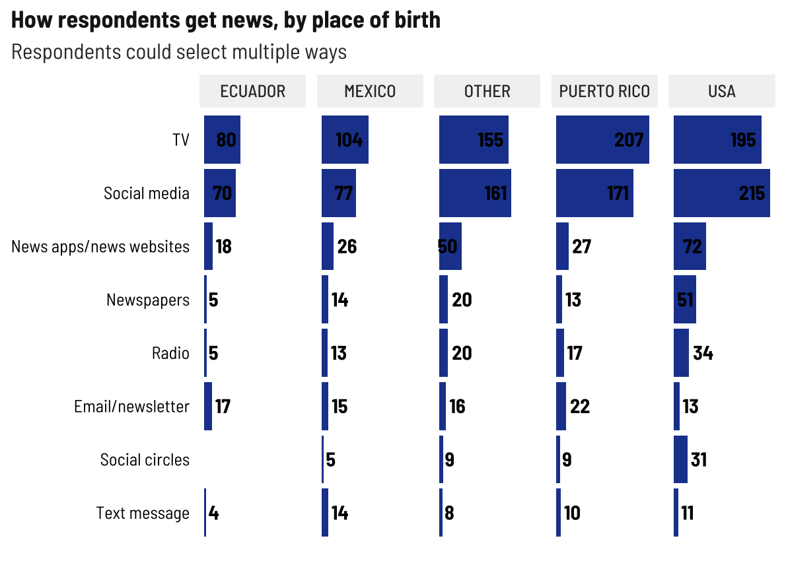
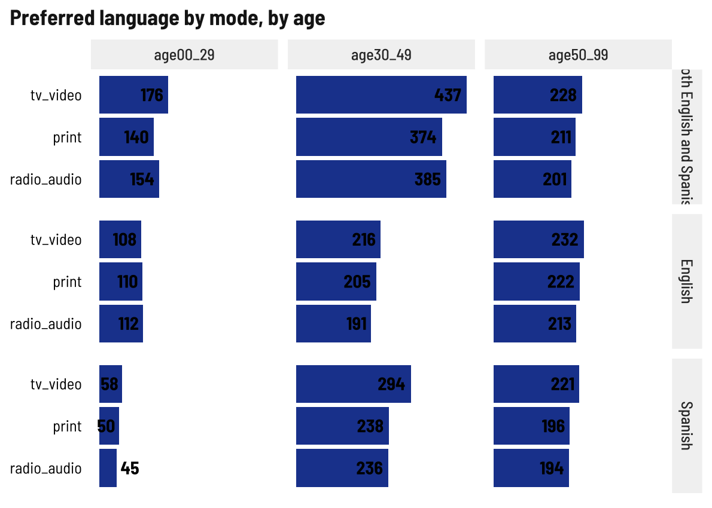
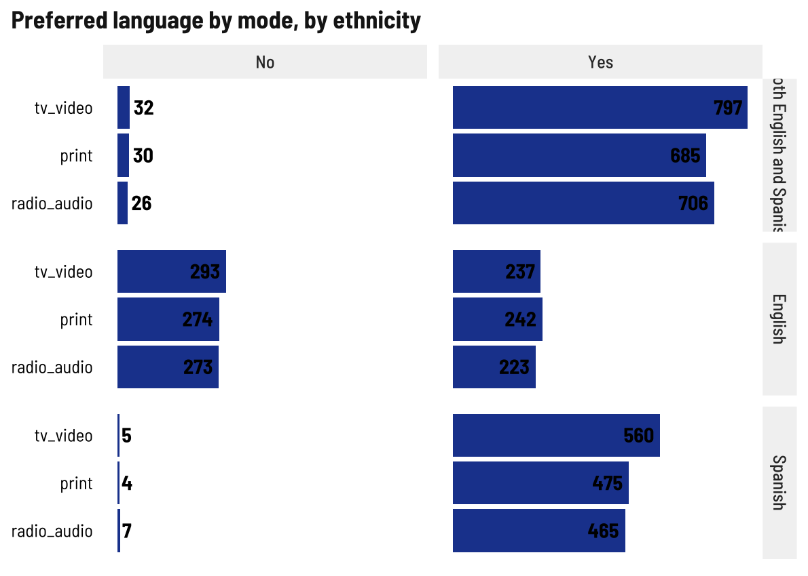
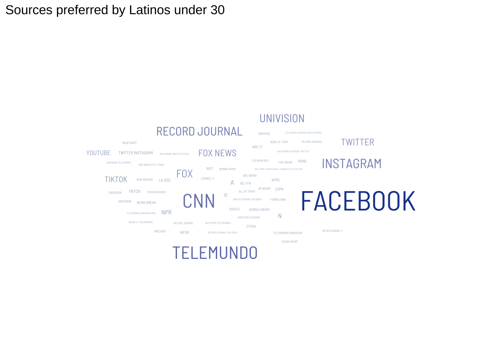
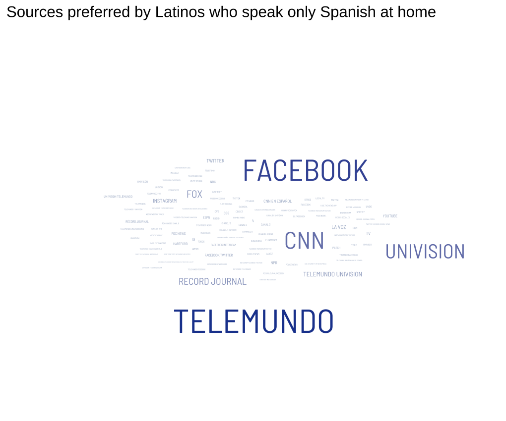

News habits
================

## Media used vs. Media preferred by total, age, and language at home

Overall totals not surprising. Strong preference for TV and social
media. I think we can just look at “used.”

<!-- -->

I expected to see variation by age, but it’s hard to say anything about
the under-30 crowd given their low response rate to this question.
Social media just ekeing out ahead of TV for 30-49 year olds is
interesting. We Milennials love a platform.

<!-- -->

I didn’t expect these to be so similar.

<!-- -->

Huh, I expected more variation here, too. I guess TV and social media
are really it.

<!-- -->

## Preferred language by age and ethnicity

Younger people really don’t seem to like *just* Spanish language
content, but have a stronger overall preference for bilingual content.

<!-- -->

Language is so important culturally, I’m not at all surprised to see
people who identify as Latino strongly preferring Spanish and bilingual
content.

<!-- -->

## News sources

Preferred sources is also an open text field. Mining for word clouds…

By age, young people put fewer answers in, older people put a lot more

<!-- --><!-- --><!-- -->

Telemundo far and away the favored source for Latinos

<!-- -->

Facebook stands out among Spanish speakers

<!-- --><!-- --><!-- -->
