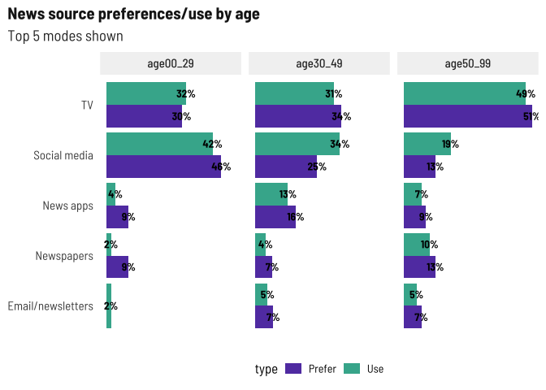
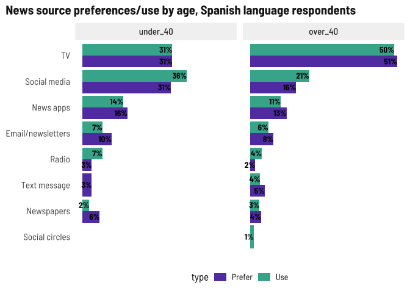
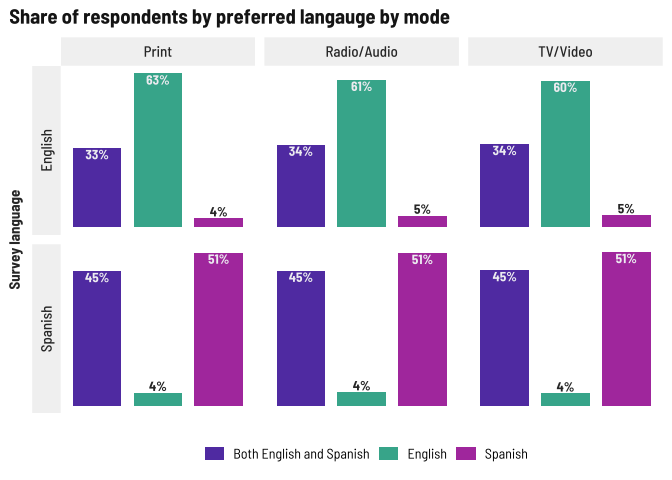
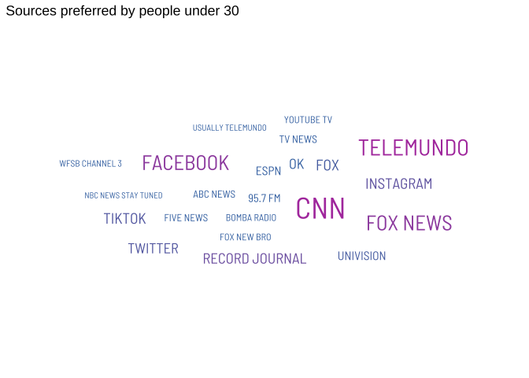

News habits
================

# News habits

## Media used vs. Media preferred

I broke these into two charts by survey language and age so we can
compare what medium they prefer to which they use more easily.

For English language respondents, there’s a greater preference than use
for Email, Text, and news apps, which I think suggest that people prefer
more of a digest style news update. TV and social media are popular, of
course. Again, I want to disaggregate this by age in the future.

<!-- -->

For Spanish language respondents, the strong preference towards TV and
social media might be in language availability as well as the content
covered in Spanish-language TV and through social circles online. Here
it would be interesting to disaggregate by age as well as topics or
geographies of interest.

<!-- -->

With language, again a strong preference towards the survey language and
“both.” In future focus groups if we can ask people who prefer both why
they do, that would be helpful.

<!-- -->

Preferred sources is also an open text field. Mining for a word cloud…

<!-- -->

Local news generally more popular than farther-out regions. Also note
that one person wrote in Puerto Rico for the geographical question.

<!-- -->

We added Food in June so it’s low now but will probably move up. Health,
education, and local events continue to top this list.

<!-- -->

Special topic areas being primarily focused on families makes sense with
who we’re surveying and how we’re collecting responses.

<!-- -->

### Trust in news media

Higher levels of trust in social circles and national news for Spanish
survey respondents makes sense based on which media they use and prefer,
while for English survey respondents, there’s a greater level of trust
in local news.

<!-- -->

Spanish survey respondents are more likely to agree with these
statements than English survey respondents, so I wonder if there’s a
cultural/political association here. I find it interesting that English
survey respondents *trust* local news more but are less likely to agree
that it reflects their beliefs.

<!-- -->
