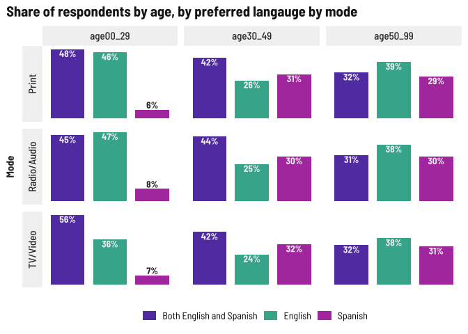
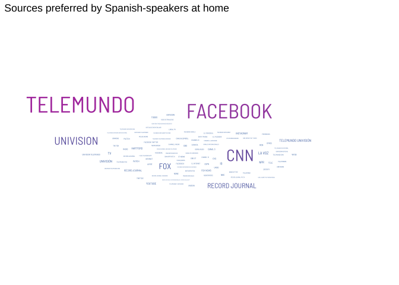

News habits
================

## Media used vs. Media preferred

By age and language at home

I expected to see variation by age.

<!-- -->

I didn’t expect these to be so similar

<!-- -->

## Preferred language by age and ethnicity

Younger people really don’t seem to like *just* Spanish language
content, but have a stronger overall preference for bilingual content.

<!-- -->

Generally speaking, respondents who identify as Latino don’t prefer
English language only content.

<!-- -->

## News sources

Preferred sources is also an open text field. Mining for word clouds…

By age, young people put fewer answers in, older people put a lot more

<!-- --><!-- --><!-- -->

Telemundo far and away the favored source for Latinos

<!-- -->

Facebook stands out among Spanish speakers

<!-- --><!-- --><!-- -->
