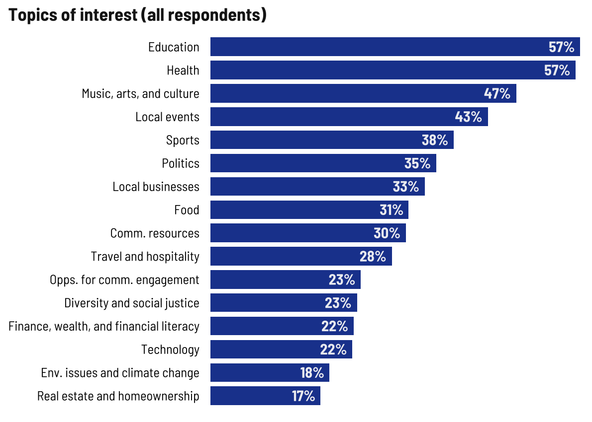
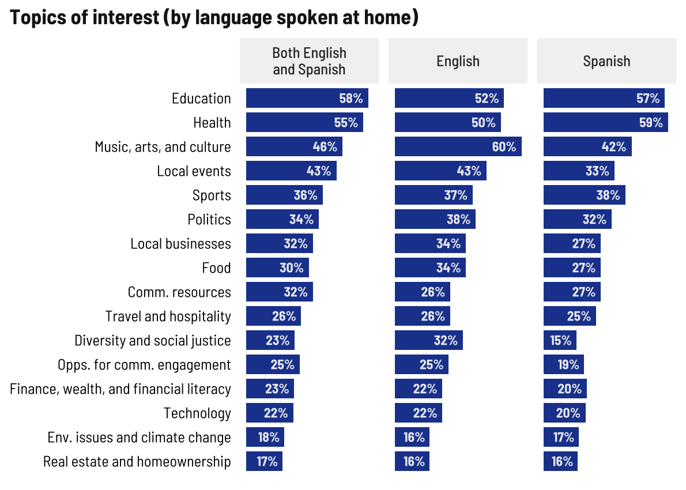
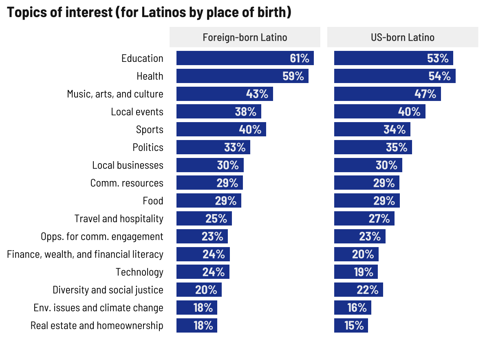
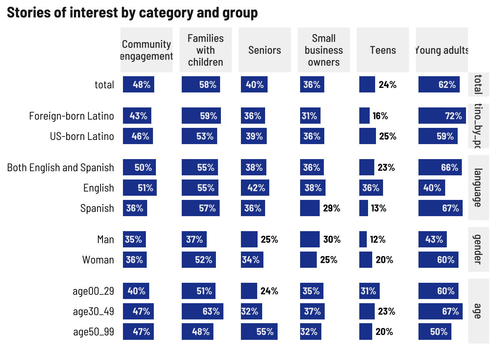

News Topics & Areas of Interest
================

## Geographic scope

More than half of respondents who speak Spanish at home are interested
in international news. Local, state, and international levels are
generally of the most interest.

<!-- -->

## Topics

This list is really long, so breaking it out by category for four
graphics.

Among all respondents, education and health still top the list. There
are many, many write-ins here that I will share separately.

<!-- -->

I’m really surprised such a small share of young people selected
environment/climate change. Music/arts/culture, education, and sports
top the list for young people. Health, education, and music/arts/culture
for the other two groups.

<!-- -->

<!-- -->

Looks like people who speak English at home also have an interest in
local events, otherwise health, education, and music top the lists
still, but Spanish-speakers also like to read about sports.

<!-- -->

Same general trends with sports ranking a bit higher among foreign-born
Latinos.

<!-- -->

## Special topics

No surprises in the ages 30-49 group wanting stories about families with
kids/youth and respondents ages 50+ wanting stories about seniors.

<!-- -->
