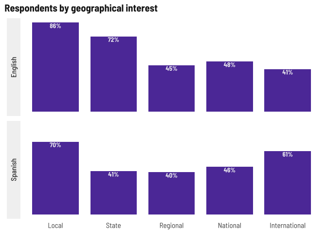
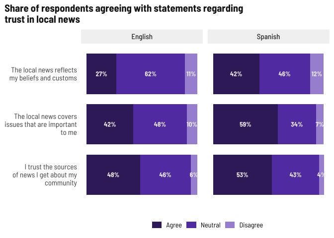

Survey summaries
================

### Read files

Current number of respondents (blanks removed) as of June 13, 2022

    ## # A tibble: 2 × 2
    ##   survey  responses
    ##   <chr>       <int>
    ## 1 English        83
    ## 2 Spanish        99

## Summaries

### Demographics

Respondents by gender

| gender                           | English | Spanish |
|:---------------------------------|:--------|:--------|
| Man                              | 26%     | 34%     |
| Non-binary/Gender non-conforming | 1%      | 0%      |
| Woman                            | 72%     | 66%     |

It might be harder to get young people to respond based on current
outreach (grocery stores, links on articles, etc.) but maybe at the PR
festival? Otherwise, we do have the HS student focus group to help fill
in that gap.

<!-- -->

Other towns are usually 1-2 people from some other location in
Connecticut. Do we want to start specifying the region around Meriden
and Wallingford as opposed to like Hartford, New Haven, Waterbury, etc.

<!-- -->

Most respondents are Latino

| latino | English | Spanish |
|:-------|:--------|:--------|
| No     | 34%     | 0%      |
| Yes    | 66%     | 100%    |

Birthplace is an open text field, need to sort around for common words

<!-- -->

Other languages for Spanish survey were “dialect” (I’m not sure which so
I put it in other), for English survey: German, Polish, Marathi.

<!-- -->

Even though most people have the internet at home, fewer Spanish survey
respondents do, which might lend towards them preferring text, word of
mouth, etc. for news.

| internet | English | Spanish |
|:---------|:--------|:--------|
| No       | 5%      | 13%     |
| Yes      | 95%     | 87%     |

Similar trends in device access. I would like to be able to disaggregate
this by age in the future.

| device | English | Spanish |
|:-------|:--------|:--------|
| No     | 5%      | 16%     |
| Yes    | 95%     | 84%     |

Voter registration status may be complicated by citizenship status,
since so many Spanish language respondents were born abroad.

<!-- -->

Lots of parents which makes sense given the grocery store outreach.
Fewer students among the Spanish language survey probably related to
fewer young people responding.

<!-- -->

### News habits

I broke these into two charts by survey language so we can compare what
medium they prefer to which they use more easily.

For English language respondents, there’s a greater preference than use
for Email, Text, and news apps, which I think suggest that people prefer
more of a digest style news update. TV and social media are popular,
too. Again, I want to disaggregate this by age in the future.

<!-- -->

For Spanish language respondents, the strong preference towards TV and
social media might be in language availability as well as the content
covered in Spanish-language TV and through social circles online. Here
it would be interesting to disaggregate by age as well as topics or
geographies of interest.

<!-- -->

With language, again a strong preference towards the survey language and
“both.” In future focus groups if we can ask people who prefer both why
they do, that would be helpful.

<!-- -->

Preferred sources is also an open text field. Mining for a word cloud…

<!-- -->

Local news generally more popular than farther-out regions. Also note
that one person wrote in Puerto Rico for the geographical question.

<!-- -->

We added Food in June so it’s low now but will probably move up. Health,
education, and local events continue to top this list.

<!-- -->

Special topic areas being primarily focused on families makes sense with
who we’re surveying and how we’re collecting responses.

<!-- -->

### Trust in news media

Higher levels of trust in social circles and national news for Spanish
survey respondents makes sense based on which media they use and prefer,
while for English survey respondents, there’s a greater level of trust
in local news.

<!-- -->

Spanish survey respondents are more likely to agree with these
statements than English survey respondents, so I wonder if there’s a
cultural/political association here. I find it interesting that English
survey respondents *trust* local news more but are less likely to agree
that it reflects their beliefs.

<!-- -->
