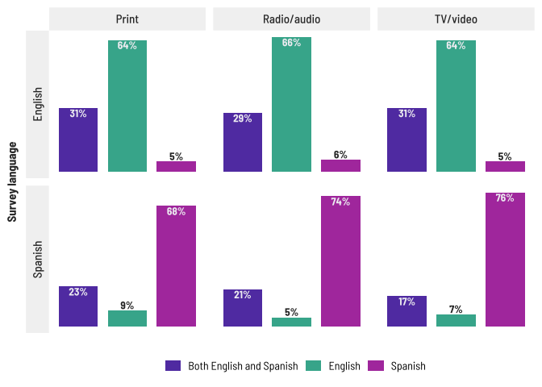
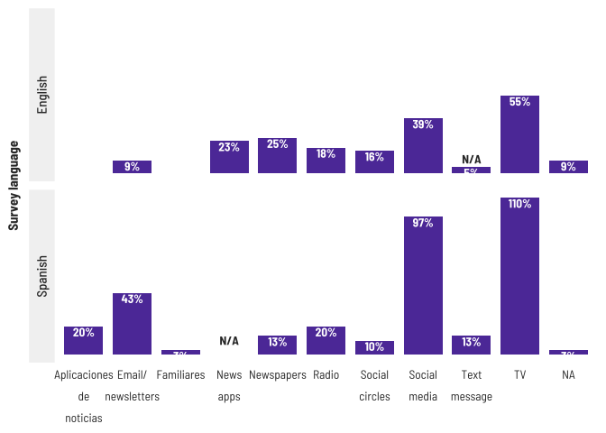
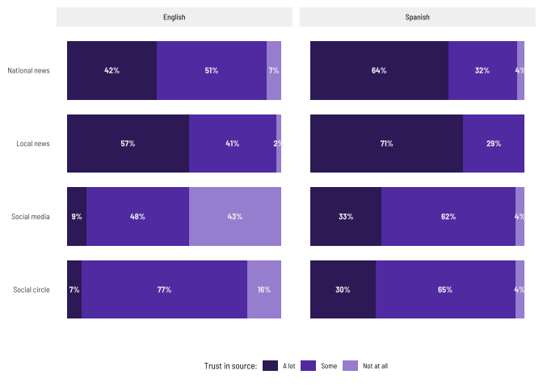
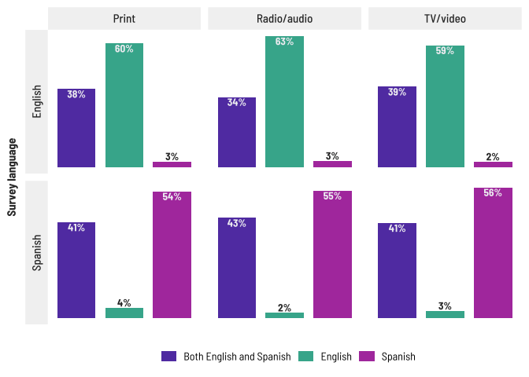

Survey summaries
================

``` r
library(tidyverse)
library(cwi)
source("../utils/plot_utils.R")
```

**Cannot just re-run this! some denoms are hard-coded for non-response,
and there’s some text mining**

``` r
path <- "../survey_data/05162022/"
plot_path <- "../distro/"
```

### Read files

``` r
read_english <- read_csv(paste(path, "(English) RJ Latino Communities Reporting Lab Survey (Responses) - Form Responses 1.csv", sep = "")) %>% 
  janitor::clean_names() %>% 
  filter(!is.na(what_town_do_you_live_in))

read_spanish <- read_csv(paste(path, "(Spanish) RJ Latino Communities Reporting Lab Survey (Responses) - Form Responses 1.csv", sep = "")) %>% 
  janitor::clean_names()

qhead_eng <- tibble(question = paste("Q", 1:31, sep = ""),
                    label = colnames(read_english))

qhead_spn <- tibble(question = paste("Q", 1:31, sep = ""),
                    label = colnames(read_spanish))

colnames(read_english) <- qhead_eng$question
colnames(read_spanish) <- qhead_spn$question  
```

## Summaries

### Demographics

``` r
response_town <- tibble(town = as.factor(read_english$Q19),
                        survey = as.factor("English")) %>% 
  bind_rows(tibble(town = as.factor(read_spanish$Q19),
                   survey = as.factor("Spanish"))) %>% 
  filter(!is.na(town)) %>% 
  mutate(town = if_else(!grepl("Meriden|Wallingford", town), "Other", as.character(town)))

response_town %>% group_by(survey, town) %>% count()
```

    ## # A tibble: 6 × 3
    ## # Groups:   survey, town [6]
    ##   survey  town            n
    ##   <fct>   <chr>       <int>
    ## 1 English Meriden        18
    ## 2 English Other          15
    ## 3 English Wallingford    11
    ## 4 Spanish Meriden        10
    ## 5 Spanish Other           1
    ## 6 Spanish Wallingford    18

``` r
response_latino <- tibble(latino = as.factor(read_english$Q20),
                 survey = as.factor("English")) %>% 
  bind_rows(tibble(latino = as.factor(read_spanish$Q20),
                   survey = as.factor("Spanish")))

response_latino %>%  group_by(survey, latino) %>% count()
```

    ## # A tibble: 5 × 3
    ## # Groups:   survey, latino [5]
    ##   survey  latino                n
    ##   <fct>   <fct>             <int>
    ## 1 English No                   15
    ## 2 English Prefer not to say     1
    ## 3 English Yes                  28
    ## 4 Spanish Prefiero no decir     1
    ## 5 Spanish Sí                   29

``` r
response_gender <- tibble(gender = as.factor(read_english$Q23),
                          survey = as.factor("English")) %>% 
  bind_rows(tibble(gender = as.factor(read_spanish$Q23),
                   survey = as.factor("Spanish")))

response_gender %>%  group_by(survey, gender) %>% count()
```

    ## # A tibble: 5 × 3
    ## # Groups:   survey, gender [5]
    ##   survey  gender     n
    ##   <fct>   <fct>  <int>
    ## 1 English Man        9
    ## 2 English Woman     35
    ## 3 Spanish Hombre     1
    ## 4 Spanish Mujer     28
    ## 5 Spanish <NA>       1

Birthplace is an open text field, need to sort around for common words

``` r
response_birthplace <- tibble(place = as.factor(read_english$Q21),
                              survey = as.factor("English")) %>% 
  bind_rows(tibble(place = as.factor(read_spanish$Q21),
                   survey = as.factor("Spanish"))) %>% 
  mutate(clean = if_else(grepl("Puerto|puerto", place), "Puerto Rico", as.character(place))) %>% 
  mutate(clean = if_else(grepl("US|Us|us|USA|United|united|UNITED|ct", place), "United States", clean))
         
response_birthplace %>% group_by(survey, clean) %>% count()
```

    ## # A tibble: 16 × 3
    ## # Groups:   survey, clean [16]
    ##    survey  clean                    n
    ##    <fct>   <chr>                <int>
    ##  1 English India                    1
    ##  2 English Mexico                   2
    ##  3 English Poland                   1
    ##  4 English Puerto Rico              4
    ##  5 English United States           35
    ##  6 English <NA>                     1
    ##  7 Spanish Argentina                2
    ##  8 Spanish Chile                    1
    ##  9 Spanish Ecuador                  5
    ## 10 Spanish Honduras                 1
    ## 11 Spanish Mexico                  12
    ## 12 Spanish Panama                   1
    ## 13 Spanish Peru                     1
    ## 14 Spanish Puerto Rico              5
    ## 15 Spanish Republica dominicana     1
    ## 16 Spanish <NA>                     1

``` r
response_lang_at_home <- tibble(lang = as.factor(read_english$Q24),
                              survey = as.factor("English")) %>% 
  bind_rows(tibble(lang = as.factor(read_spanish$Q24),
                   survey = as.factor("Spanish")))

response_lang_at_home %>% group_by(survey, lang) %>% count()
```

    ## # A tibble: 8 × 3
    ## # Groups:   survey, lang [8]
    ##   survey  lang                         n
    ##   <fct>   <fct>                    <int>
    ## 1 English Both English and Spanish    18
    ## 2 English English                     20
    ## 3 English Marathi                      1
    ## 4 English Polish                       1
    ## 5 English Spanglish                    1
    ## 6 English Spanish                      3
    ## 7 Spanish Ambos: inglés y español     10
    ## 8 Spanish Español                     20

``` r
response_web_at_home <- tibble(internet = as.factor(read_english$Q27),
                           survey = as.factor("English")) %>% 
  bind_rows(tibble(internet = as.factor(read_spanish$Q27),
                   survey = as.factor("Spanish")))

response_web_at_home %>% group_by(survey, internet) %>% count()
```

    ## # A tibble: 5 × 3
    ## # Groups:   survey, internet [5]
    ##   survey  internet     n
    ##   <fct>   <fct>    <int>
    ## 1 English No           2
    ## 2 English Yes         42
    ## 3 Spanish No           1
    ## 4 Spanish Sí          28
    ## 5 Spanish <NA>         1

``` r
response_device <- tibble(device = as.factor(read_english$Q26),
                          survey = as.factor("English")) %>% 
  bind_rows(tibble(device = as.factor(read_spanish$Q26),
                   survey = as.factor("Spanish")))

response_device %>% group_by(device, survey) %>% count()
```

    ## # A tibble: 5 × 3
    ## # Groups:   device, survey [5]
    ##   device survey      n
    ##   <fct>  <fct>   <int>
    ## 1 No     English     1
    ## 2 No     Spanish     1
    ## 3 Yes    English    42
    ## 4 Sí     Spanish    29
    ## 5 <NA>   English     1

``` r
response_voter <- tibble(registered = as.factor(read_english$Q28),
       survey = as.factor("English")) %>% 
  bind_rows(tibble(registered = as.factor(read_spanish$Q28),
                   survey = as.factor("Spanish")))

response_voter %>% group_by(registered, survey) %>% count()
```

    ## # A tibble: 8 × 3
    ## # Groups:   registered, survey [8]
    ##   registered        survey      n
    ##   <fct>             <fct>   <int>
    ## 1 No                English    10
    ## 2 No                Spanish    17
    ## 3 Not sure          English     1
    ## 4 Prefer not to say English     1
    ## 5 Yes               English    32
    ## 6 No estoy seguro/a Spanish     1
    ## 7 Prefiero no decir Spanish     3
    ## 8 Sí                Spanish     9

``` r
response_details <- tibble(indicator = as.factor(read_english$Q25),
                           survey = as.factor("English")) %>% 
  bind_rows(tibble(indicator = as.factor(read_spanish$Q25),
                   survey = as.factor("Spanish"))) %>% 
  mutate(student = if_else(grepl("stu", indicator), T, F),
         parent = if_else(grepl("18", indicator), T, F),
         biz = if_else(grepl("business|empresa", indicator), T, F)) %>% 
  mutate(across(survey:biz, as.factor))

response_details %>% group_by(survey, biz) %>% count()
```

    ## # A tibble: 4 × 3
    ## # Groups:   survey, biz [4]
    ##   survey  biz       n
    ##   <fct>   <fct> <int>
    ## 1 English FALSE    42
    ## 2 English TRUE      2
    ## 3 Spanish FALSE    29
    ## 4 Spanish TRUE      1

### News habits

``` r
response_mode <- tibble(mode = as.factor(read_english$Q9),
                           survey = as.factor("English")) %>% 
  bind_rows(tibble(mode = as.factor(read_spanish$Q9),
                   survey = as.factor("Spanish"))) %>% 
  mutate(clean = if_else(grepl("app|online", mode), "News apps", as.character(mode))) %>% 
  mutate(clean = if_else(mode %in% c("Medios sociales"), "Social media", clean),
         clean = if_else(grepl("Amistades|Friends", clean), "Social circles", clean),
         clean = if_else(grepl("Correo", clean), "Email/newsletters", clean),
         clean = if_else(grepl("Periódicos", clean), "Newspapers", clean),
         clean = if_else(clean == "Textos", "Text message", clean))
```

<!-- -->

``` r
response_pref_mode <- tibble(mode = as.factor(read_english$Q11),
                        survey = as.factor("English")) %>% 
  bind_rows(tibble(mode = as.factor(read_spanish$Q11),
                   survey = as.factor("Spanish"))) %>% 
  mutate(clean = if_else(grepl("app|online|noticias|Same", mode), "News apps", as.character(mode))) %>% 
  mutate(clean = if_else(mode %in% c("Medios sociales"), "Social media", clean),
         clean = if_else(grepl("Amistades|Friends", clean), "Social circles", clean),
         clean = if_else(grepl("Correo", clean), "Email/newsletter", clean),
         clean = if_else(grepl("Periódicos", clean), "Newspapers", clean),
         clean = if_else(clean %in% c("Textos", "Celular"), "Text message", clean))
```

<!-- -->

``` r
pref_lang <- tibble(tv_video = as.factor(read_english$Q6),
                    radio_audio = as.factor(read_english$Q7),
                    print = as.factor(read_english$Q8),
                    survey = as.factor("English")) %>% 
  bind_rows(tibble(tv_video = as.factor(read_spanish$Q6),
                   radio_audio = as.factor(read_spanish$Q7),
                   print = as.factor(read_spanish$Q8),
                   survey = as.factor("Spanish"))) %>% 
  mutate(tv_video2 = if_else(grepl("Inglés", tv_video), "English", as.character(tv_video))) %>% 
  mutate(tv_video2 = if_else(grepl("Español", tv_video), "Spanish", tv_video2),
         tv_video2 = if_else(grepl("Ambos", tv_video), "Both English and Spanish", tv_video2)) %>% 
  mutate(radio_audio2 = if_else(grepl("Inglés", radio_audio), "English", as.character(radio_audio))) %>% 
  mutate(radio_audio2 = if_else(grepl("Español", radio_audio), "Spanish", radio_audio2),
         radio_audio2 = if_else(grepl("Ambos", radio_audio), "Both English and Spanish", radio_audio2)) %>% 
  mutate(print2 = if_else(grepl("Inglés", print), "English", as.character(print))) %>% 
  mutate(print2 = if_else(grepl("Español", print), "Spanish", print2),
         print2 = if_else(grepl("Ambos", print), "Both English and Spanish", print2)) %>% 
  select(survey, Print = print2, `TV/video` = tv_video2, `Radio/audio` = radio_audio2)
```

<!-- -->

Preferred sources is also an open text field. Mining for a word cloud…

``` r
eng_list <- str_split(read_english$Q10, ",| and | or|\\/|  ", simplify = T)
spn_list <- str_split(read_spanish$Q10, ",| and | or|\\/|  ", simplify = T)
x <- tibble(source = c(spn_list, eng_list)) %>% 
  filter(!is.na(source), source != "") %>% 
  mutate(source = str_to_upper(source)) %>%
  mutate(source = str_trim(source, side = "both")) %>% 
  mutate(source = str_remove(source,  c(" IF AVAILABLE| PRINT EDITION"))) %>% 
  filter(!source %in% c("N", "A", "FACEBOOK GOOGLE", "HARTFORD COURANT TELEMUNDO WFSB 3 TELEFE INTERNATIONAL", "RECORD JOURNAL FACEBOOK")) %>% #will add these back properly below
  mutate(source = if_else(grepl("RECORD|RJ", source), "RECORD-JOURNAL", source),
         source = if_else(grepl("NBC|CHANNEL 30", source), "NBC", source),
         source = if_else(grepl("FOX", source), "FOX NEWS", source),
         source = if_else(grepl("CHANNEL 8", source), "WTNH", source),
         source = if_else(grepl("WFSB", source), "WFSB", source),
         source = if_else(grepl("BREAK", source), "NEWSBREAK", source),
         source = if_else(grepl("LOCAL", source), "LOCAL STATIONS", source),
         source = if_else(grepl("HEARD", source), "NEW BRITAIN HERALD", source),
         source = if_else(grepl("WAPO", source), "WASHINGTON POST", source)) %>% 
  mutate(source = str_trim(source, side = "both"))

cloud <- x %>% group_by(source) %>% count()
```

<!-- -->

``` r
eng_geo <- tibble(geo = c(str_split(read_english$Q2, ", ", simplify = T)),
                  survey = "English")
spn_geo <- tibble(geo = c(str_split(read_spanish$Q2, ", ", simplify = T)),
                  survey = "Spanish")

response_geos <- bind_rows(eng_geo, spn_geo) %>% 
  filter(geo != "") %>% 
  mutate(geo = if_else(geo == "Estatal", "State", geo),
         geo = if_else(geo == "Nacional", "National", geo),
         geo = if_else(grepl("Inter", geo), "International", geo),
         geo = if_else(grepl("Regional", geo), "Regional", geo))
```

<!-- -->

We added Food in June, so there will be a new category to add next time
this is run

``` r
eng_topic <- tibble(topic = c(str_split(read_english$Q3, ", (?=[A-Z])", simplify = T)),
                  survey = "English")

spn_topic <- tibble(topic = c(str_split(read_spanish$Q3, ", (?=[A-Z])", simplify = T)),
                  survey = "Spanish")

response_topic <- bind_rows(eng_topic, spn_topic) %>%
  filter(topic != "") %>% 
  filter(!grepl("ratings", topic)) %>% #medical facilities = health
  add_row(topic = "Health", survey = "English") %>% 
  mutate(topic = if_else(grepl("arte", topic), "Music, arts, and culture", topic),
         topic = if_else(grepl("Educ", topic), "Education", topic),
         topic = if_else(grepl("Negocios", topic), "Local businesses", topic),
         topic = if_else(grepl("Eventos", topic), "Local events", topic),
         topic = if_else(grepl("Políticas", topic), "Politics", topic),
         topic = if_else(grepl("Salud", topic), "Health", topic),
         topic = if_else(grepl("Deportes", topic), "Sports", topic),
         topic = if_else(grepl("resources|Recursos", topic), "Community resources", topic),
         topic = if_else(grepl("Diversidad", topic), "Diversity and social justice", topic),
         topic = if_else(grepl("Tecno", topic), "Technology", topic),
         topic = if_else(grepl("Finanzas", topic), "Finance, wealth, and financial literacy", topic),
         topic = if_else(grepl("Oport", topic), "Opportunities for community engagement", topic),
         topic = if_else(grepl("Viajes", topic), "Travel and hospitality", topic),
         topic = if_else(grepl("cambio", topic), "Environmental issues & climate change", topic),
         topic = if_else(grepl("vivienda", topic), "Real estate and homeownership", topic)) %>% 
  mutate(topic = str_replace(topic, "&", "and"),
         topic = str_replace(topic, "Environmental", "Env."),
         topic = str_replace(topic, "Opportunities", "Opps."),
         topic = str_replace(topic, "Community", "Comm."),
         topic = str_replace(topic, "community", "comm."))
```

<!-- -->

``` r
eng_special_topic <- tibble(topic = c(str_split(read_english$Q4, ", (?=[A-Z])", simplify = T)),
                    survey = "English") %>% 
  mutate(topic = str_remove(topic, "Topics related to "))
spn_special_topic <- tibble(topic = c(str_split(read_spanish$Q4, ", (?=[A-Z])", simplify = T)),
                    survey = "Spanish") %>% 
  mutate(topic = str_remove(topic, "Temas acerca de "))

response_special_topic <- bind_rows(eng_special_topic, spn_special_topic) %>%
  filter(topic != "") %>% 
  mutate(topic = str_to_sentence(topic)) %>% 
  mutate(topic = if_else(grepl("Familias", topic), "Families with children", topic),
         topic = if_else(grepl("Propietarios", topic), "Small business owners", topic),
         topic = if_else(grepl("edad", topic), "Seniors", topic),
         topic = if_else(grepl("Los", topic), "Teens", topic),
         topic = if_else(grepl("Jóvenes", topic), "Young adults", topic),
         topic = if_else(grepl("Participacion", topic), "Community engagement", topic))

response_special_topic %>% 
  group_by(survey, topic) %>%
  count() %>% 
  ungroup() %>% 
  mutate(topic = as.factor(topic),
         topic = fct_rev(topic)) %>% 
  mutate(share = if_else(survey == "English", n/44, n/30)) %>% 
  ggplot(aes(x = share, y = reorder(topic, share))) +
  geom_col(width = .8) +
  geom_text(aes(label = scales::percent(share, accuracy = 1)), hjust = 1.2, size = 2.75) +
  facet_grid(cols = vars(survey)) +
  theme(axis.text.x = element_blank(),
        text = element_text(size = 9)) +
  labs(y = "Topics relevant to...", x = NULL)
```

<!-- -->

``` r
#ggsave(filename = "special_topic.png", path = plot_path, dpi = "screen")
```

### Trust in news media

``` r
trust <- tibble(national_news = as.factor(read_english$Q12),
                local_news = as.factor(read_english$Q13),
                social_media = as.factor(read_english$Q14),
                social_circle = as.factor(read_english$Q15),
                survey = as.factor("English")) %>% 
  bind_rows(tibble(national_news = as.factor(read_spanish$Q12),
                   local_news = as.factor(read_spanish$Q13),
                   social_media = as.factor(read_spanish$Q14),
                   social_circle = as.factor(read_spanish$Q15),
                   survey = as.factor("Spanish"))) %>% 
  pivot_longer(cols = national_news:social_circle, names_to = "level", values_to = "response") %>% 
  mutate(response = fct_collapse(response, `A lot` = c("A lot", "Mucho"),
                                 Some = c("Some", "Un poco"),
                                 `Not at all` = c("Not at all", "Para nada"))) %>% 
  group_by(survey, level, response) %>% 
  count() %>% 
  ungroup() %>%
  pivot_wider(id_cols = c("survey", "level"), names_from = "response", values_from = "n") %>% 
  select(-`NA`) %>% 
  mutate(`Not at all` = replace_na(`Not at all`, 0)) %>% 
  rowwise() %>% 
  mutate(total = sum(`A lot` + Some + `Not at all`, na.rm = T)) %>% 
  pivot_longer(cols = `A lot`:total, names_to = "response", values_to = "value") %>% 
  mutate(level = str_replace(level, "_", " "),
         level = str_to_sentence(level)) %>% 
  group_by(survey, level) %>% 
  camiller::calc_shares(group = response, denom = "total", value = value)
```

<!-- -->

``` r
labels <- tibble(code = c("Q1", "Q2", "Q3"), 
            question = c("I trust the sources of news I get about my community", "The local news covers issues that are important to me", "The local news reflects my beliefs and customs"))
                         
beliefs <- tibble(Q1 = read_english$Q16,
                Q2 = read_english$Q17,
                Q3 = read_english$Q18,
                survey = as.factor("English")) %>% 
  bind_rows(tibble(Q1 = read_spanish$Q16,
                   Q2 = read_spanish$Q17,
                   Q3 = read_spanish$Q18,
                   survey = as.factor("Spanish"))) %>% 
  pivot_longer(cols = Q1:Q3, names_to = "code", values_to = "response") %>% 
  mutate(response = if_else(response == "De acuerdo", "Agree", response),
         response = if_else(response == "En desacuerdo", "Disagree", response)) %>% 
  group_by(survey, code, response) %>% 
  count() %>% 
  ungroup() %>% 
  left_join(labels, by = "code") %>% 
  select(-code) %>% 
  pivot_wider(id_cols = c("survey", "question"), names_from = "response", values_from = "n") %>% 
  select(-`NA`) %>% 
  rowwise() %>% 
  mutate(Disagree = replace_na(Disagree, 0)) %>% 
  mutate(total = sum(Agree + Disagree + Neutral, na.rm = T)) %>% 
  pivot_longer(cols = Agree:total, names_to = "response", values_to = "value") %>% 
  group_by(survey, question) %>% 
  camiller::calc_shares(group = response, denom = "total", value = value) %>% 
  ungroup() %>% 
  filter(!is.na(share))
```

<!-- -->
