Survey summaries
================

**Cannot just re-run this! some denoms are hard-coded for non-response,
and there’s some text mining**

### Read files

    ## # A tibble: 2 × 2
    ##   survey  responses
    ##   <chr>       <int>
    ## 1 English        83
    ## 2 Spanish        99

## Summaries

### Demographics

| gender                           | English | Spanish |
|:---------------------------------|:--------|:--------|
| Man                              | 26%     | 34%     |
| Non-binary/Gender non-conforming | 1%      | 0%      |
| Woman                            | 72%     | 66%     |

Respondents by gender

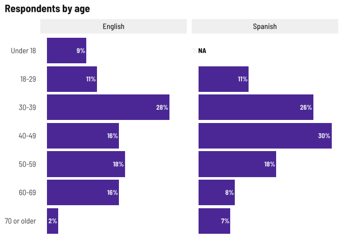<!-- -->

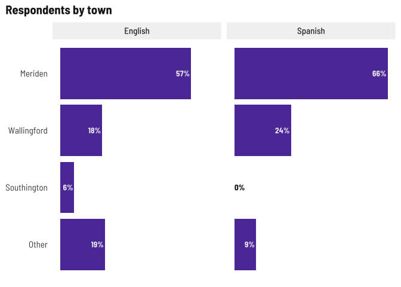<!-- -->

| latino | English | Spanish |
|:-------|:--------|:--------|
| No     | 34%     | 0%      |
| Yes    | 66%     | 100%    |

Share of Latino respondents

Birthplace is an open text field, need to sort around for common words

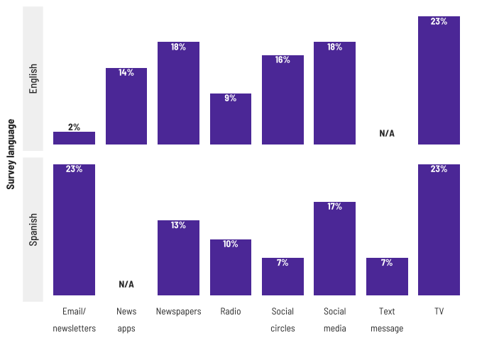<!-- -->

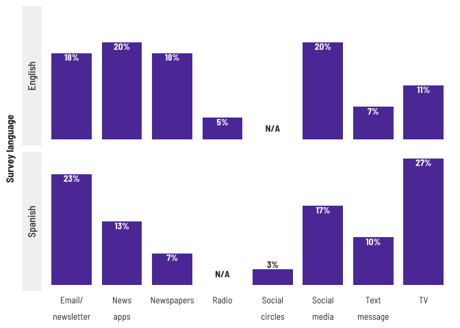<!-- -->

| internet | English | Spanish |
|:---------|:--------|:--------|
| No       | 5%      | 13%     |
| Yes      | 95%     | 87%     |

Respondents with internet at home

| device | English | Spanish |
|:-------|:--------|:--------|
| No     | 5%      | 16%     |
| Yes    | 95%     | 84%     |

Respondents with smart devices

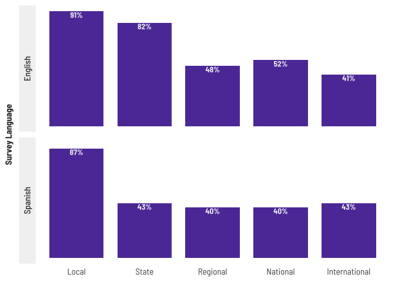<!-- -->

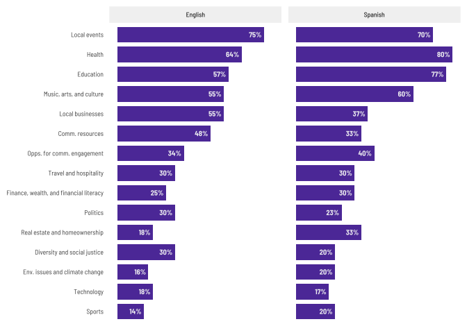<!-- -->

### News habits

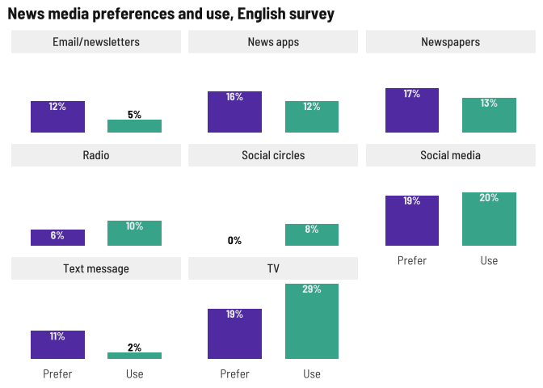<!-- -->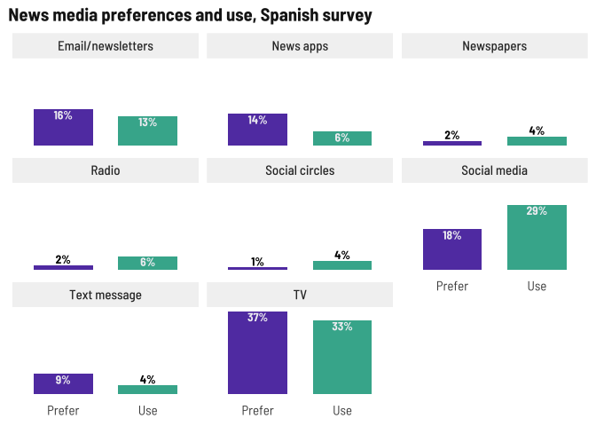<!-- -->

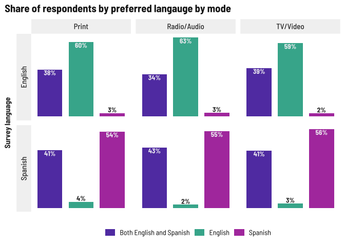<!-- -->

Preferred sources is also an open text field. Mining for a word cloud…

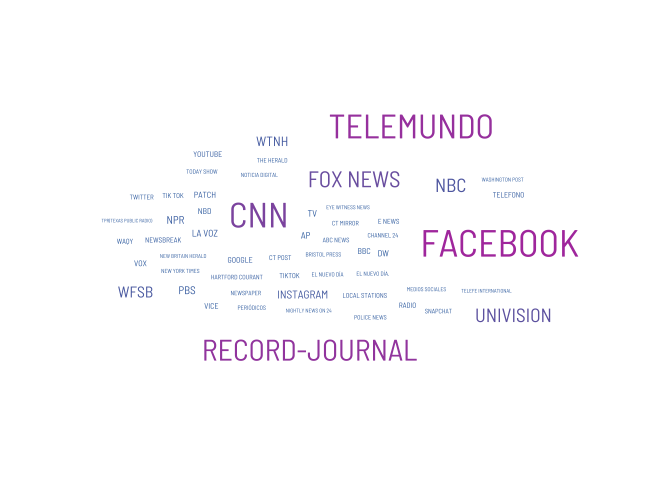<!-- -->

Denoms are hard-coded so we get share of respondents, not share of
responses

Also note that one person wrote in Puerto Rico for the geographical
question.

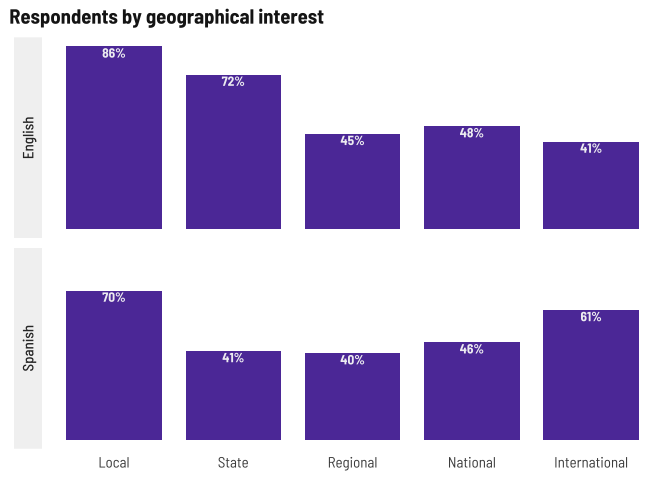<!-- -->

We added Food in June. Also hard coded denoms.

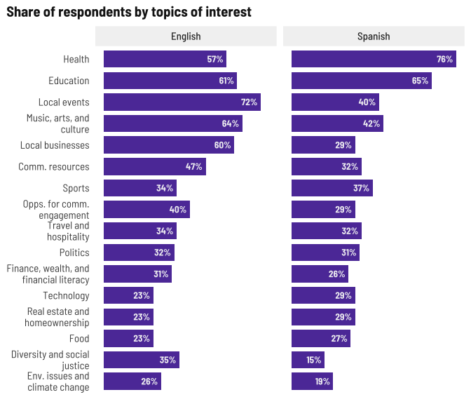<!-- -->

<!-- -->

### Trust in news media

<!-- -->

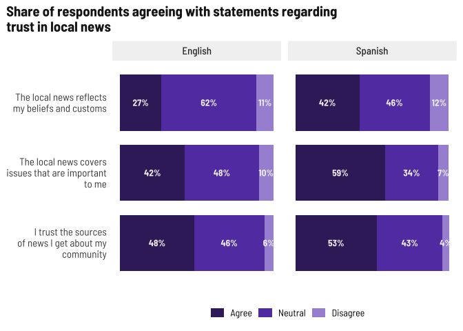<!-- -->
