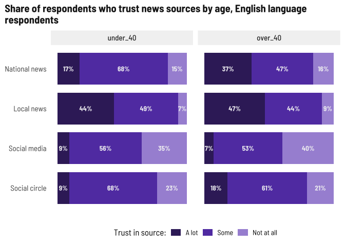
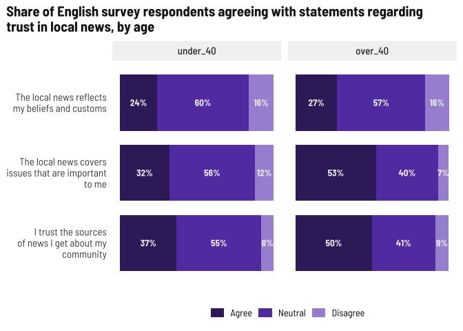

Trust in news media
================

Both age groups for the English survey seem to trust local news while
being mostly ambivalent about the other sources. Older adults have more
trust in national news.

<!-- -->

Higher levels of trust among Spanish respondents, with national news
topping the list. I’d still call this a tossup overall.

<!-- -->

## Beliefs

Still interesting that about half of younger English survey respondents
trust local news but don’t agree with these statements… mismatch in
preferred coverage while thinking the existing coverage is accurate?

<!-- -->

Generally higher levels of agreement here, but still a tossup for
younger respondents. Thinking about topics, younger populations seemed
to want more arts/culture and events where older adults were interested
in big topics like health or education.

<!-- -->
