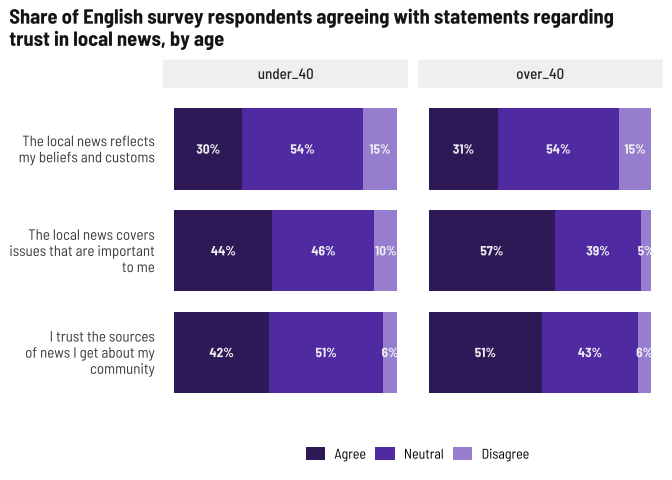

Trust in news media
================

Add PR festival data, hard code paths since it won’t change, bind to
primary surveys.

Just realized I deleted an entire section from the English PR Festival
survey… I’ll summarize what we have for the Spanish respondents, but the
questions were those about what content they’d like to see.

Both age groups for the English survey seem to trust local news while
being mostly ambivalent about the other sources. Older adults have more
trust in national news. Social media is the least trusted.

<!-- -->

Higher levels of trust among Spanish respondents, with national news
topping the list. I’d still call this a tossup overall.

<!-- -->

## Beliefs

Still interesting that about half of younger English survey respondents
trust local news but don’t agree with these statements… mismatch in
preferred coverage while thinking the existing coverage is accurate?
Majorities of the over-40 crowd of English respondents trust sources of
local news and feel it’s covers issues important to them, but don’t
necessarily agree the news reflects their own beliefs.

<!-- -->

Generally higher levels of agreement here, but still a tossup for
younger respondents. Thinking about topics, younger populations seemed
to want more arts/culture and events where older adults were interested
in big topics like health or education. Still the majority of both age
groups believe the local news covers issues important to them.

<!-- -->
