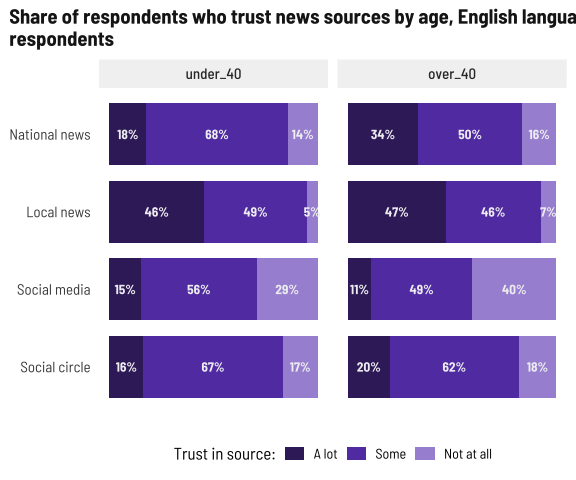

Trust in news media
================

Higher levels of trust in social circles and national news for Spanish
survey respondents makes sense based on which media they use and prefer,
while for English survey respondents, there’s a greater level of trust
in local news.

<!-- -->

<!-- -->

## Beliefs

Spanish survey respondents are more likely to agree with these
statements than English survey respondents, so I wonder if there’s a
cultural/political association here. I find it interesting that English
survey respondents *trust* local news more but are less likely to agree
that it reflects their beliefs.

<!-- -->

<!-- -->
