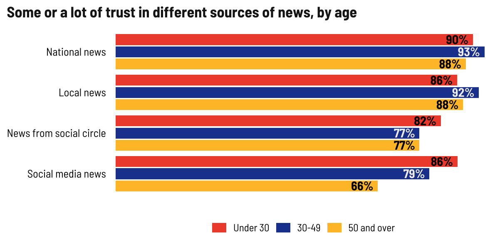
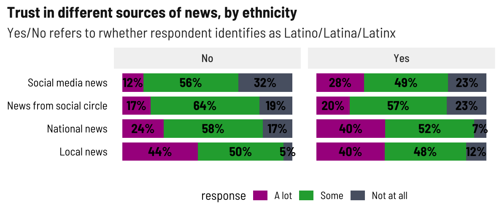
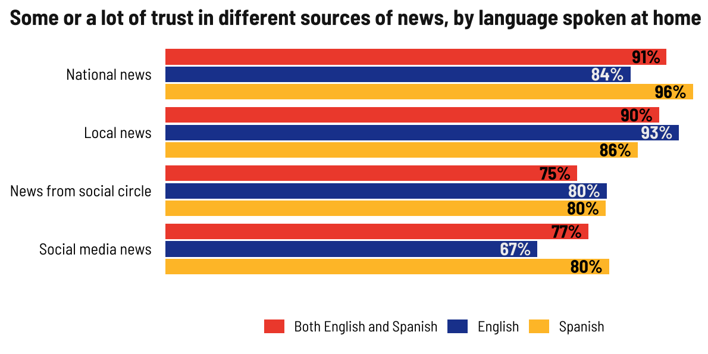
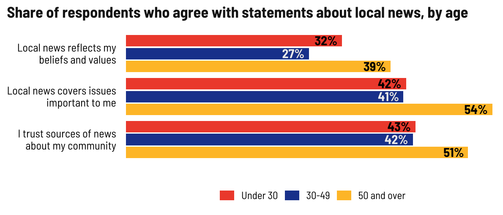
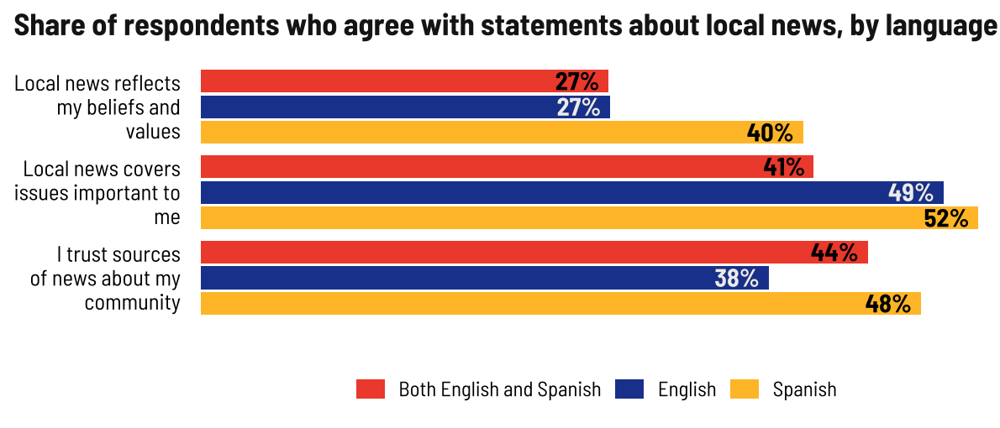

Trust in news media
================

## Trustworthiness by source by group

Local news tops the trustworthiness list among all age groups. Older
adults are more skeptical of social media/social circles. I wonder if
that’s related to whether or not they even use those sources.

<!-- -->

Latinos trust social media news at more than twice the rate of
non-Latinos. Again local news tops the list, but Latinos also trust
national news sources (Telemundo, etc.) at a higher rate than
non-Latinos. Again, like social media among older people, I wonder if
it’s that non-Latinos tend to prefer local news.

<!-- -->

Similar trend in people who speak Spanish or both languages at home–
greater trust in national news sources. People who speak English at home
generally distrust social media more.

<!-- -->

## Beliefs

Most older adults believe the news covers important topics and they
trust the sources of news they get, but there’s a lot of ambivalence
about whether news reflects their values, although a plurality of older
adults agree with that. We see this in our DCWS survey data, too… older
adults just think more stuff is relevant to them.

<!-- -->

No real dissimilarities here. These probably trend towards general
totals.

<!-- -->

People who speak Spanish at home are more likely to agree that local
news reflects their beliefs. I wonder if this is influenced by the fact
people are answering this survey for their local paper.

<!-- -->
